# Windows 11 KVM — Template QCOW2

## Guide complet d'installation

> **Projet :** Création d'un template maître Windows 11 au format QCOW2 sous KVM/QEMU/libvirt
> **Hôte :** `x-srv01`
> **Système hôte :** Ubuntu 24.04.4 LTS
> **Objectif :** Construire un template maître Windows 11 reproductible pour KVM/libvirt

---

## Table des matières générale

### Partie 1 — Identification de l'environnement
1. [Objectif de la Partie 1](#partie-1-objectif)
2. [Identification de l'hôte](#1-identification-de-lhôte)
3. [Identification des adresses IP](#2-identification-des-adresses-ip-de-lhôte)
4. [Inventaire des VM existantes](#3-inventaire-initial-des-machines-virtuelles)
5. [Identification du processeur](#4-identification-du-processeur)
6. [Vérification de la mémoire RAM](#5-vérification-de-la-mémoire-ram)
7. [Identification du stockage](#6-identification-du-stockage)
8. [Vérification de l'espace disponible](#7-vérification-de-lespace-disponible)
9. [Vérification de l'accélération KVM](#8-vérification-de-laccélération-kvm)
10. [Vérification de `/dev/kvm`](#9-vérification-du-périphérique-devkvm)
11. [Vérification des versions libvirt/QEMU](#10-vérification-des-versions-libvirt-et-qemu)
12. [Vérification directe de QEMU](#11-vérification-directe-de-qemu)
13. [Vérification des composants de virtualisation](#12-vérification-des-composants-de-virtualisation-installés)
14. [Vérification du firmware UEFI/OVMF](#13-vérification-du-firmware-uefiovmf)
15. [Identification des réseaux libvirt](#14-identification-des-réseaux-libvirt)
16. [Analyse du réseau `default`](#15-analyse-du-réseau-default)
17. [Identification des interfaces réseau](#16-identification-des-interfaces-réseau-de-lhôte)
18. [Vérification de l'état des interfaces](#17-vérification-de-létat-des-interfaces)
19. [Analyse du réseau `lab-net`](#18-analyse-du-réseau-lab-net)
20. [Inventaire des interfaces des VM](#19-inventaire-des-interfaces-réseau-des-vm-existantes)
21. [Vérification du service libvirt](#20-vérification-du-service-libvirt)
22. [Vérification des réseaux](#21-vérification-du-réseau-default)
23. [État initial consolidé](#22-état-initial-consolidé)
24. [Conclusion Partie 1](#23-conclusion-de-la-partie-1)

### Partie 2 — Préparation du projet et validation des médias
25. [Objectif de la Partie 2](#partie-2-objectif)
26. [Répertoire des ISO](#24-répertoire-des-iso)
27. [Validation de l'ISO Windows 11](#25-validation-de-liso-windows-11)
28. [Recherche d'une ISO VirtIO](#26-recherche-dune-iso-virtio-existante)
29. [Téléchargement de l'ISO VirtIO](#27-téléchargement-de-liso-virtio)
30. [Validation de l'ISO VirtIO](#28-validation-de-liso-virtio)
31. [Vérification de l'espace disque](#29-vérification-de-lespace-disque)
32. [Inventaire des pools libvirt](#30-inventaire-des-pools-de-stockage-libvirt)
33. [Vérification détaillée des pools](#31-vérification-détaillée-des-pools)
34. [Vérification du pool de stockage](#32-vérification-du-pool-de-stockage-utilisé)
35. [Inventaire des volumes du pool `images`](#33-inventaire-des-volumes-du-pool-images)
36. [Chemin physique du pool `images`](#34-identification-du-chemin-physique-du-pool-images)
37. [État des médias du projet](#35-état-des-médias-du-projet)
38. [Synthèse de validation](#36-synthèse-de-validation)
39. [État du projet après la Partie 2](#37-état-du-projet-après-la-partie-2)

### Partie 3 — Vérification des prérequis de la VM Windows 11
40. [Objectif de la Partie 3](#partie-3-objectif)
41. [Vérification du répertoire de stockage libvirt](#38-vérification-du-répertoire-de-stockage-libvirt)
42. [Vérification de l'accès utilisateur](#39-vérification-de-laccès-utilisateur)
43. [Vérification avec privilèges administrateur](#40-vérification-avec-les-privilèges-administrateur)
44. [Inventaire des images](#41-inventaire-des-images)
45. [Vérification de l'émulateur TPM](#42-vérification-de-lémulateur-tpm)
46. [Vérification des composants TPM 2.0](#43-vérification-des-composants-tpm-20)
47. [Vérification du firmware UEFI OVMF](#44-vérification-du-firmware-uefi-ovmf)
48. [Vérification du paquet OVMF](#45-vérification-du-paquet-ovmf)
49. [Synthèse des prérequis Windows 11](#46-synthèse-des-prérequis-windows-11)
50. [Configuration cible envisagée](#47-configuration-cible-envisagée)
51. [Modifications effectuées](#48-modifications-effectuées-pendant-la-partie-3)
52. [Conclusion Partie 3](#49-conclusion--partie-3)

### Partie 4 — Préparation de la VM Windows 11 maître
53. [Objectif de la Partie 4](#partie-4-objectif)
54. [Vérification de l'existence de la VM](#41--vérification-de-lexistence-de-la-vm)
55. [Vérification de l'environnement de création](#42--vérification-de-lenvironnement-de-création)
56. [Définition de la configuration cible](#43--définition-de-la-configuration-cible)
57. [Préparation du disque QCOW2](#44--préparation-du-disque-qcow2)
58. [Vérification et permissions du disque](#45--vérification-et-permissions-du-disque)
59. [Préparation CPU / RAM](#46--préparation-cpu--ram)
60. [Préparation UEFI / OVMF](#47--préparation-uefi--ovmf)
61. [Préparation du TPM 2.0](#48--préparation-du-tpm-20)
62. [Préparation du réseau VirtIO](#49--préparation-du-réseau-virtio)
63. [Préparation des médias Windows 11 et VirtIO](#410--préparation-des-médias-windows-11-et-virtio)
64. [Synthèse de la préparation](#411--synthèse-de-la-préparation)
65. [Conclusion Partie 4](#conclusion-de-la-partie-4)

### Partie 5 — Création et démarrage de la VM Windows 11
66. [Objectif de la Partie 5](#partie-5-objectif)
67. [Vérification de la gestion NVRAM par virt-install](#51-vérification-de-la-gestion-nvram-par-virt-install)
68. [Vérification de l'option `--graphics`](#52-vérification-de-loption---graphics)
69. [Vérification de l'option TPM](#53-vérification-de-loption-tpm)
70. [Première tentative de création de la VM](#54-première-tentative-de-création-de-la-vm)
71. [Création réussie de la VM](#55-création-réussie-de-la-vm-win11-lab)
72. [Configuration graphique VNC](#56-configuration-graphique-vnc)
73. [Identification du display VNC](#57-identification-du-display-vnc)
74. [Mise en place du tunnel SSH depuis le Mac M1](#58-mise-en-place-du-tunnel-ssh-depuis-le-mac-m1)
75. [Validation du tunnel avec netcat](#59-validation-du-tunnel-avec-netcat)
76. [Connexion avec TigerVNC](#510-connexion-avec-tigervnc)
77. [Démarrage sur le firmware UEFI](#511-démarrage-sur-le-firmware-uefi)
78. [Sélection du périphérique de démarrage](#512-sélection-du-périphérique-de-démarrage)
79. [Démarrage de Windows Setup](#513-démarrage-de-windows-setup)
80. [État de la VM à la fin de la Partie 5](#514-état-de-la-vm-à-la-fin-de-la-partie-5)
81. [Erreur rencontrée et correction](#515-erreur-rencontrée-et-correction)
82. [Architecture obtenue](#516-architecture-obtenue)

### Partie 6 — Installation, configuration initiale et préparation de Windows 11
83. [Objectif de la Partie 6](#partie-6-objectif)
84. [Création de la VM Windows 11](#62-création-de-la-vm-windows-11)
85. [Accès à la console VNC](#63-accès-à-la-console-vnc)
86. [Démarrage UEFI de Windows](#64-démarrage-uefi-de-windows)
87. [Paramètres régionaux](#65-paramètres-régionaux)
88. [Détection du disque VirtIO](#66-détection-du-disque-virtio)
89. [Redémarrage pendant l'installation](#67-redémarrage-pendant-linstallation)
90. [Redémarrage de `win11-lab`](#68-redémarrage-de-win11-lab)
91. [Première configuration Windows 11](#69-première-configuration-windows-11)
92. [Problème initial de réseau](#610-problème-initial-de-réseau)
93. [Identification du lecteur VirtIO](#611-identification-du-lecteur-virtio)
94. [Localisation du pilote réseau VirtIO](#612-localisation-du-pilote-réseau-virtio)
95. [Installation du pilote réseau VirtIO](#613-installation-du-pilote-réseau-virtio)
96. [Première tentative du bypass OOBE](#614-première-tentative-du-bypass-oobe)
97. [Correction du chemin pour `BYPASSNRO`](#615-correction-du-chemin-pour-bypassnro)
98. [Création d'un compte local](#616-création-dun-compte-local)
99. [Connexion Internet](#617-connexion-internet)
100. [Mises à jour Windows](#618-mises-à-jour-windows)
101. [Arrêt volontaire de la VM](#619-arrêt-volontaire-de-la-vm-pour-reprise-sur-lhôte)
102. [Bureau Windows 11 fonctionnel](#620-bureau-windows-11-fonctionnel)
103. [État final de la Partie 6](#621-état-final-de-la-partie-6)
104. [Validation de fin de phase](#622-validation-de-fin-de-phase)
105. [Prochaine phase](#623-prochaine-phase)
106. [Arrêt propre de Windows 11](#624-arrêt-propre-de-windows-11)
107. [Vérification des périphériques de stockage](#625-vérification-des-périphériques-de-stockage)
108. [Éjection de l'ISO Windows 11](#626-éjection-de-liso-windows-11)
109. [Éjection de l'ISO VirtIO](#627-éjection-de-liso-virtio)
110. [Sauvegarde de la configuration libvirt](#628-sauvegarde-de-la-configuration-libvirt)
111. [Vérification de l'état administratif de la VM](#629-vérification-de-létat-administratif-de-la-vm)
112. [État final de cette étape](#630-état-final-de-cette-étape)

### Annexes
113. [Références techniques](#annexe-a--références-techniques)
114. [État du projet global](#annexe-b--état-du-projet-global)

---

# PARTIE 1 — IDENTIFICATION DE L'ENVIRONNEMENT

---

## Partie 1 — Objectif

Avant de créer une nouvelle machine virtuelle Windows 11, il est nécessaire de connaître précisément l'environnement dans lequel elle sera hébergée.

Cette première partie constitue donc un **état initial de référence** de l'hôte.

L'objectif est de déterminer :

- l'identité de l'hôte ;
- le système d'exploitation ;
- le noyau Linux ;
- l'architecture matérielle ;
- le processeur ;
- le nombre de cœurs et de threads ;
- la disponibilité de la virtualisation matérielle ;
- la quantité de RAM ;
- l'espace disque disponible ;
- la configuration KVM ;
- les versions de QEMU et libvirt ;
- la présence de Virt-Manager ;
- la présence d'OVMF/UEFI ;
- la présence de `swtpm` pour le TPM virtuel ;
- les réseaux virtuels libvirt ;
- les interfaces réseau de l'hôte ;
- les interfaces réseau des VM existantes ;
- l'état du service libvirt.

**Aucune modification de configuration n'a été effectuée dans cette partie.**

Toutes les commandes présentées ci-dessous ont été exécutées sur l'hôte `x-srv01`.

---

## 1. Identification de l'hôte

### 1.1 Commande utilisée

```bash
hostnamectl
```

### 1.2 Résultat obtenu

```text
kaman-goumou@x-srv01:~$ hostnamectl
 Static hostname: x-srv01
       Icon name: computer-convertible
         Chassis: convertible
      Machine ID: c849c027591e4c73b75ed3d0b1547fb0
         Boot ID: 2e13d09f1ddf473c8158034b22d46f44
Operating System: Ubuntu 24.04.4 LTS
          Kernel: Linux 7.0.0-31-generic
    Architecture: x86-64
 Hardware Vendor: HP
  Hardware Model: HP ENVY x360 Convertible 15m-ed0xxx
Firmware Version: F.30
    Firmware Date: Thu 2024-03-28
    Firmware Age: 2y 5month 1w 3d
```

### 1.3 Analyse

L'hôte utilisé pour le projet est :

```text
Hostname          : x-srv01
Operating System  : Ubuntu 24.04.4 LTS
Kernel            : Linux 7.0.0-31-generic
Architecture      : x86-64
Hardware Vendor   : HP
Hardware Model    : HP ENVY x360 Convertible 15m-ed0xxx
Firmware Version  : F.30
```

L'architecture `x86-64` est adaptée à l'exécution d'une VM Windows 11 64 bits.

### 1.4 Validation

**État : VALIDÉ**

---

## 2. Identification des adresses IP de l'hôte

### 2.1 Commande utilisée

```bash
hostname -I
```

### 2.2 Résultat obtenu

```text
kaman-goumou@x-srv01:~$ hostname -I
192.168.1.17 192.168.120.1 192.168.121.1 100.126.199.105 172.17.0.1 fd7a:115c:a1e0::3437:c76a
```

### 2.3 Analyse

Les adresses observées sont :

```text
192.168.1.17
192.168.120.1
192.168.121.1
100.126.199.105
172.17.0.1
fd7a:115c:a1e0::3437:c76a
```

L'adresse `192.168.1.17` correspond à l'interface physique `wlo1`. Les adresses `192.168.120.1` et `192.168.121.1` correspondent aux deux réseaux virtuels libvirt.

### 2.4 Validation

**État : VALIDÉ**

---

## 3. Inventaire initial des machines virtuelles

### 3.1 Commande utilisée

```bash
virsh list --all
```

### 3.2 Résultat obtenu

```text
kaman-goumou@x-srv01:~$ virsh list --all
 Id   Name                    State
----------------------------------------
 -    eve-ng                  shut off
 -    proxmox-ve              shut off
 -    Srv-centos-stream9      shut off
 -    srv01-monitoring        shut off
 -    ubuntu-24.04-template   shut off
 -    winserver2022           shut off
 -    x-srvsoc                shut off
 -    x-srvsoc2               shut off
```

### 3.3 Analyse

Les VM actuellement déclarées dans libvirt sont :

```text
eve-ng
proxmox-ve
Srv-centos-stream9
srv01-monitoring
ubuntu-24.04-template
winserver2022
x-srvsoc
x-srvsoc2
```

Toutes les VM étaient dans l'état `shut off` au moment de cette vérification.

### 3.4 Validation

**État : VALIDÉ**

---

## 4. Identification du processeur

### 4.1 Commande utilisée

```bash
lscpu
```

### 4.2 Résultat obtenu

```text
Architecture:                x86_64
CPU op-mode(s):              32-bit, 64-bit
Address sizes:               39 bits physical, 48 bits virtual
Byte Order:                  Little Endian
CPU(s):                      8
On-line CPU(s) list:        0-7
Vendor ID:                   GenuineIntel
Model name:                  Intel(R) Core(TM) i5-1035G1 CPU @ 1.00GHz
CPU family:                  6
Model:                       126
Thread(s) per core:          2
Core(s) per socket:          4
Socket(s):                   1
Stepping:                    5
CPU(s) scaling MHz:          19%
CPU max MHz:                 3600.0000
CPU min MHz:                 400.0000
BogoMIPS:                    2380.80
Virtualization features:
  Virtualization:            VT-x
```

### 4.3 Analyse

Le processeur est :

```text
Intel Core i5-1035G1
```

Configuration :

```text
Cœurs physiques : 4
Threads          : 8
Sockets          : 1
```

La virtualisation matérielle Intel **VT-x** est disponible.

### 4.4 Validation

**État : VALIDÉ**

---

## 5. Vérification de la mémoire RAM

### 5.1 Commande utilisée

```bash
free -h
```

### 5.2 Résultat obtenu

```text
kaman-goumou@x-srv01:~$ free -h
               total        used        free      shared  buff/cache   available
Mem:            23Gi       1.6Gi        12Gi        92Mi         9Gi        21Gi
Swap:          8.0Gi          0B       8.0Gi
```

### 5.3 Analyse

L'hôte dispose de :

```text
RAM totale       : 23 GiB
RAM utilisée     : 1.6 GiB
RAM libre        : 12 GiB
RAM disponible   : 21 GiB
Swap             : 8 GiB
Swap utilisée    : 0 B
```

### 5.4 Validation

**État : VALIDÉ**

La quantité de RAM disponible est suffisante pour envisager une VM Windows 11 avec une allocation initiale de **8 GiB**.

---

## 6. Identification du stockage

### 6.1 Commande utilisée

```bash
lsblk -o NAME,SIZE,TYPE,FSTYPE,MOUNTPOINTS
```

### 6.2 Résultat obtenu

```text
NAME     SIZE TYPE FSTYPE   MOUNTPOINTS
sda    476.9G disk
├─sda1     1G part vfat     /boot/efi
└─sda2 475.9G part ext4     /
```

### 6.3 Analyse

Le disque principal est `/dev/sda` avec une capacité de **476.9 GiB**.

Le système Ubuntu est installé sur `/dev/sda2`.

### 6.4 Validation

**État : VALIDÉ**

---

## 7. Vérification de l'espace disponible

### 7.1 Commande utilisée

```bash
df -h /
```

### 7.2 Résultat obtenu

```text
kaman-goumou@x-srv01:~$ df -h /
Filesystem      Size  Used Avail Use% Mounted on
/dev/sda2       468G  255G  190G  58% /
```

### 7.3 Analyse

Au moment du contrôle :

```text
Taille totale : 468 GiB
Utilisé       : 255 GiB
Disponible    : 190 GiB
Occupation    : 58 %
```

Il reste donc environ **190 GiB** d'espace disponible.

### 7.4 Validation

**État : VALIDÉ**

---

## 8. Vérification de l'accélération KVM

### 8.1 Commande utilisée

```bash
kvm-ok
```

### 8.2 Résultat obtenu

```text
kaman-goumou@x-srv01:~$ kvm-ok
INFO: /dev/kvm exists
KVM acceleration can be used
```

### 8.3 Validation

**État : VALIDÉ**

---

## 9. Vérification du périphérique `/dev/kvm`

### 9.1 Commande utilisée

```bash
ls -l /dev/kvm
```

### 9.2 Résultat obtenu

```text
kaman-goumou@x-srv01:~$ ls -l /dev/kvm
crw-rw----+ 1 root kvm 10, 232 Sep  7 05:33 /dev/kvm
```

### 9.3 Validation

**État : VALIDÉ**

---

## 10. Vérification des versions libvirt et QEMU

### 10.1 Commande utilisée

```bash
virsh version
```

### 10.2 Résultat obtenu

```text
kaman-goumou@x-srv01:~$ virsh version
Compiled against library: libvirt 10.0.0
Using library: libvirt 10.0.0
Using API: QEMU 10.0.0
Running hypervisor: QEMU 8.2.2
```

### 10.3 Validation

**État : VALIDÉ**

---

## 11. Vérification directe de QEMU

### 11.1 Commande utilisée

```bash
qemu-system-x86_64 --version
```

### 11.2 Résultat obtenu

```text
kaman-goumou@x-srv01:~$ qemu-system-x86_64 --version
QEMU emulator version 8.2.2 (Debian 1:8.2.2+ds-0ubuntu1.18)
Copyright (c) 2003-2023 Fabrice Bellard and the QEMU Project developers
```

### 11.3 Validation

**État : VALIDÉ**

---

## 12. Vérification des composants de virtualisation installés

### 12.1 Commande utilisée

```bash
dpkg -l | grep -E 'qemu-kvm|libvirt|virt-manager|ovmf|swtpm'
```

### 12.2 Résultat obtenu

```text
ii  libvirt-clients                                10.0.0-2ubuntu8.16                               amd64        Programs for the libvirt library
ii  libvirt-daemon                                 10.0.0-2ubuntu8.16                               amd64        Virtualization daemon
ii  libvirt-daemon-config-network                  10.0.0-2ubuntu8.16                               all          Libvirt daemon configuration files (default network)
ii  libvirt-daemon-system                          10.0.0-2ubuntu8.16                               amd64        Libvirt daemon configuration files
ii  libvirt0:amd64                                 10.0.0-2ubuntu8.16                               amd64        library for interfacing with different virtualization systems
ii  ovmf                                           2024.02-2ubuntu0.9                               all          UEFI firmware for 64-bit x86 virtual machines
ii  swtpm                                          0.7.3-0ubuntu5.24.04.1                           amd64        Libtpms-based TPM emulator
ii  swtpm-tools                                    0.7.3-0ubuntu5.24.04.1                           amd64        Tools for the TPM emulator
ii  virt-manager                                   1:4.1.0-3ubuntu0.1                               all          desktop application for managing virtual machines
```

### 12.3 Validation

**État : VALIDÉ**

Les principaux composants logiciels nécessaires au projet sont déjà installés.

---

## 13. Vérification du firmware UEFI/OVMF

### 13.1 Commande utilisée

```bash
ls -l /usr/share/OVMF/
```

### 13.2 Résultat obtenu

```text
kaman-goumou@x-srv01:~$ ls -l /usr/share/OVMF/
total 8720
-rw-r--r-- 1 root root 3653632 Jun  2 12:48 OVMF_CODE_4M.fd
lrwxrwxrwx 1 root root      23 Jun  2 12:48 OVMF_CODE_4M.ms.fd -> OVMF_CODE_4M.secboot.fd
-rw-r--r-- 1 root root 3653632 Jun  2 12:48 OVMF_CODE_4M.secboot.fd
lrwxrwxrwx 1 root root      23 Jun  2 12:48 OVMF_CODE_4M.snakeoil.fd -> OVMF_CODE_4M.secboot.fd
-rw-r--r-- 1 root root  540672 Jun  2 12:48 OVMF_VARS_4M.fd
-rw-r--r-- 1 root root  540672 Jun  2 12:48 OVMF_VARS_4M.ms.fd
-rw-r--r-- 1 root root  540672 Jun  2 12:48 OVMF_VARS_4M.snakeoil.fd
```

### 13.3 Validation

**État : VALIDÉ**

L'environnement dispose du firmware UEFI/OVMF nécessaire.

---

## 14. Identification des réseaux libvirt

### 14.1 Commande utilisée

```bash
virsh net-list --all
```

### 14.2 Résultat obtenu

```text
 Name      State    Autostart   Persistent
--------------------------------------------
 default   active   yes         yes
 lab-net   active   yes         yes
```

### 14.3 Validation

**État : VALIDÉ**

---

## 15. Analyse du réseau `default`

### 15.1 Commande utilisée

```bash
virsh net-dumpxml default
```

### 15.2 Résultat obtenu

```xml
<network>
  <name>default</name>
  <uuid>2de5e17e-1b29-4b67-890c-94639c4ec261</uuid>
  <forward mode='nat'>
    <nat>
      <port start='1024' end='65535'/>
    </nat>
  </forward>
  <bridge name='virbr0' stp='on' delay='0'/>
  <mac address='52:54:00:d8:9e:39'/>
  <ip address='192.168.120.1' netmask='255.255.255.0'>
    <dhcp>
      <range start='192.168.120.2' end='192.168.120.254'/>
    </dhcp>
  </ip>
</network>
```

### 15.3 Validation

**État : VALIDÉ**

---

## 16. Identification des interfaces réseau de l'hôte

### 16.1 Commande utilisée

```bash
ip -br addr
```

### 16.2 Résultat obtenu

```text
lo               UNKNOWN        127.0.0.1/8 ::1/128
wlo1             UP             192.168.1.17/24 fe80::7d82:6c9:fb9f:7f74/64
virbr0           DOWN           192.168.120.1/24
virbr1           DOWN           192.168.121.1/24
tailscale0       UNKNOWN        100.126.199.105/32 fd7a:115c:a1e0::3437:c76a/128 fe80::b0fa:9e9d:6797:73c5/64
docker0          DOWN           172.17.0.1/16
```

### 16.3 Validation

**État : VALIDÉ**

---

## 17. Vérification de l'état des interfaces

### 17.1 Commande utilisée

```bash
ip -br link
```

### 17.2 Résultat obtenu

```text
lo               UNKNOWN        00:00:00:00:00:00 <LOOPBACK,UP,LOWER_UP>
wlo1             UP             f8:ac:65:03:c7:21 <BROADCAST,MULTICAST,UP,LOWER_UP>
virbr0           DOWN           52:54:00:d8:9e:39 <NO-CARRIER,BROADCAST,MULTICAST,UP>
virbr1           DOWN           52:54:00:12:34:56 <NO-CARRIER,BROADCAST,MULTICAST,UP>
tailscale0       UNKNOWN        <POINTOPOINT,MULTICAST,NOARP,UP,LOWER_UP>
docker0          DOWN           76:39:10:0c:44:2a <NO-CARRIER,BROADCAST,MULTICAST,UP>
```

### 17.3 Validation

**État : VALIDÉ**

---

## 18. Analyse du réseau `lab-net`

### 18.1 Commande utilisée

```bash
virsh net-dumpxml lab-net
```

### 18.2 Résultat obtenu

```xml
<network>
  <name>lab-net</name>
  <uuid>64df1a4d-63b5-47a5-88e3-51f54b179652</uuid>
  <forward mode='nat'>
    <nat>
      <port start='1024' end='65535'/>
    </nat>
  </forward>
  <bridge name='virbr1' stp='on' delay='0'/>
  <mac address='52:54:00:12:34:56'/>
  <ip address='192.168.121.1' netmask='255.255.255.0'>
    <dhcp>
      <range start='192.168.121.2' end='192.168.121.254'/>
    </dhcp>
  </ip>
</network>
```

### 18.3 Validation

**État : VALIDÉ**

---

## 19. Inventaire des interfaces réseau des VM existantes

### 19.1 Commande utilisée

```bash
for vm in $(virsh list --all --name); do
    echo "===== $vm ====="
    virsh domiflist "$vm"
done
```

### 19.2 Résultat obtenu

| VM | Réseau | Modèle | Adresse MAC |
|----|--------|--------|-------------|
| `eve-ng` | `default` | VirtIO | `52:54:00:42:37:34` |
| `eve-ng` | `lab-net` | VirtIO | `52:54:00:b3:4c:c8` |
| `proxmox-ve` | `default` | VirtIO | `52:54:00:79:99:c9` |
| `Srv-centos-stream9` | `default` | VirtIO | `52:54:00:86:54:89` |
| `srv01-monitoring` | `default` | VirtIO | `52:54:00:c4:2c:4b` |
| `ubuntu-24.04-template` | `default` | VirtIO | `52:54:00:9c:dd:fa` |
| `winserver2022` | `default` | VirtIO | `52:54:00:58:dd:14` |
| `x-srvsoc` | `default` | VirtIO | `52:54:00:97:40:0c` |
| `x-srvsoc2` | `default` | VirtIO | `52:54:00:be:32:84` |

### 19.3 Observation importante

Toutes les interfaces réseau des VM existantes utilisent le modèle **VirtIO**.

### 19.4 Validation

**État : VALIDÉ**

---

## 20. Vérification du service libvirt

### 20.1 Commande utilisée

```bash
systemctl status libvirtd --no-pager
```

### 20.2 Résultat obtenu

```text
● libvirtd.service - libvirt legacy monolithic daemon
     Loaded: loaded (/usr/lib/systemd/system/libvirtd.service; enabled; preset: enabled)
     Active: active (running) since Mon 2026-09-07 05:40:02 GMT; 2min 52s ago
```

### 20.3 Validation

**État : VALIDÉ**

---

## 21. Vérification du réseau `default`

### 21.1 Commande utilisée

```bash
virsh net-info default
```

### 21.2 Résultat obtenu

```text
Name:           default
UUID:           2de5e17e-1b29-4b67-890c-94639c4ec261
Active:         yes
Persistent:     yes
Autostart:      yes
Bridge:         virbr0
```

### 21.3 Validation

**État : VALIDÉ**

---

## 22. Vérification du réseau `lab-net`

### 22.1 Commande utilisée

```bash
virsh net-info lab-net
```

### 22.2 Résultat obtenu

```text
Name:           lab-net
UUID:           64df1a4d-63b5-47a5-88e3-51f54b179652
Active:         yes
Persistent:     yes
Autostart:      yes
Bridge:         virbr1
```

### 22.3 Validation

**État : VALIDÉ**

---

## 23. État initial consolidé

| Catégorie | Élément | Valeur |
|-----------|---------|--------|
| **Hôte** | Hostname | x-srv01 |
| | OS | Ubuntu 24.04.4 LTS |
| | Kernel | Linux 7.0.0-31-generic |
| | Architecture | x86-64 |
| **Processeur** | CPU | Intel Core i5-1035G1 |
| | Cœurs physiques | 4 |
| | Threads | 8 |
| | Virtualisation | Intel VT-x |
| **Mémoire** | RAM totale | 23 GiB |
| | RAM disponible | 21 GiB |
| | Swap | 8 GiB |
| **Stockage** | Disque | /dev/sda (476.9 GiB) |
| | Partition système | /dev/sda2 (468 GiB) |
| | Espace disponible | 190 GiB |
| **Virtualisation** | KVM | disponible |
| | /dev/kvm | présent |
| | libvirt | 10.0.0 |
| | QEMU | 8.2.2 |
| | Virt-Manager | 4.1.0 |
| **Firmware** | OVMF | installé |
| | UEFI | disponible |
| | Secure Boot | disponible |
| **TPM** | swtpm | installé |
| | TPM 2.0 stack | disponible |
| **Réseaux** | default | 192.168.120.0/24 |
| | lab-net | 192.168.121.0/24 |

---

## 24. Conclusion de la Partie 1

L'analyse de l'environnement confirme que l'hôte `x-srv01` dispose des composants matériels et logiciels nécessaires pour commencer la création d'une machine virtuelle Windows 11.

Les éléments critiques ont tous été validés :

```text
Intel VT-x             ✅
/dev/kvm               ✅
KVM acceleration       ✅
libvirt                ✅
QEMU                   ✅
Virt-Manager           ✅
OVMF / UEFI            ✅
Secure Boot firmware   ✅
swtpm / TPM            ✅
RAM disponible         ✅
Espace disque          ✅
Réseau libvirt         ✅
```

---

# PARTIE 2 — PRÉPARATION DU PROJET ET VALIDATION DES MÉDIAS

---

## Partie 2 — Objectif

Cette partie prépare l'environnement nécessaire à la création du futur **template maître Windows 11 au format QCOW2**.

Les objectifs sont :

- identifier l'ISO Windows 11 ;
- vérifier sa taille et son type ;
- calculer son empreinte SHA-256 ;
- rechercher une ISO VirtIO existante ;
- constater son absence ;
- télécharger une ISO VirtIO adaptée à KVM/QEMU ;
- vérifier cette ISO ;
- vérifier l'espace disque disponible ;
- identifier les pools de stockage libvirt ;
- identifier le pool destiné aux disques des machines virtuelles ;
- identifier son chemin physique ;
- inventorier les disques déjà présents.

**Aucune machine virtuelle Windows 11 n'a encore été créée dans cette partie.**

---

## 25. Répertoire des ISO

### 25.1 Commande

```bash
ls
```

### 25.2 Résultat

```text
ubuntu-24.04.4-live-server-amd64.iso  Win11_23H2_EnglishInternational_x64v2.iso
```

### 25.3 Interprétation

Le répertoire contient :

- l'ISO Ubuntu Server utilisée dans le précédent projet ;
- l'ISO Windows 11 destinée au nouveau projet.

---

## 26. Validation de l'ISO Windows 11

### 26.1 Taille et permissions

**Commande :**

```bash
ls -lh Win11_23H2_EnglishInternational_x64v2.iso
```

**Résultat :**

```text
-rwxr-xr-x 1 kaman-goumou kaman-goumou 6.4G Jun 20  2024 Win11_23H2_EnglishInternational_x64v2.iso
```

### 26.2 Type de fichier

**Commande :**

```bash
file Win11_23H2_EnglishInternational_x64v2.iso
```

**Résultat :**

```text
Win11_23H2_EnglishInternational_x64v2.iso: ISO 9660 CD-ROM filesystem data 'CCCOMA_X64FRE_EN-GB_DV9' (bootable)
```

### 26.3 Empreinte SHA-256

**Commande :**

```bash
sha256sum Win11_23H2_EnglishInternational_x64v2.iso
```

**Résultat :**

```text
705ac061688ffd7f5721da844d01df85433856eafaa8441ece94b270685ca2db  Win11_23H2_EnglishInternational_x64v2.iso
```

### 26.4 Validation

**ISO Windows 11 : VALIDÉE**

- Présente : ✅
- Taille vérifiée : ✅
- Type ISO 9660 : ✅
- Média amorçable : ✅
- SHA-256 calculé : ✅

---

## 27. Recherche d'une ISO VirtIO existante

### 27.1 Première recherche

**Commande :**

```bash
find ~/lab /var/lib/libvirt /opt -type f \( -iname "virtio*.iso" -o -iname "*virtio*.iso" \) 2>/dev/null
```

**Résultat :**

```text

```

### 27.2 Recherche étendue

**Commande :**

```bash
sudo find / -type f \( -iname "virtio*.iso" -o -iname "*virtio*.iso" \) 2>/dev/null
```

**Résultat :**

```text

```

### 27.3 Conclusion

Aucune ISO VirtIO existante n'a été trouvée sur le système.

---

## 28. Téléchargement de l'ISO VirtIO

### 28.1 Commande

```bash
wget -O virtio-win.iso \
https://fedorapeople.org/groups/virt/virtio-win/direct-downloads/stable-virtio/virtio-win.iso
```

### 28.2 Résultat

```text
virtio-win.iso                  100%[======================================================>] 836.73M  3.68MB/s    in 13m 50s

2026-09-07 06:06:46 (1.01 MB/s) - ‘virtio-win.iso’ saved [877373440/877373440]
```

### 28.3 Version obtenue

Le serveur a fourni :

```text
virtio-win-0.1.302
```

---

## 29. Validation de l'ISO VirtIO

### 29.1 Taille et permissions

**Commande :**

```bash
ls -lh virtio-win.iso
```

**Résultat :**

```text
-rw-rw-r-- 1 kaman-goumou kaman-goumou 837M Aug 27 23:50 virtio-win.iso
```

### 29.2 Type de fichier

**Commande :**

```bash
file virtio-win.iso
```

**Résultat :**

```text
virtio-win.iso: ISO 9660 CD-ROM filesystem data 'virtio-win-0.1.302'
```

### 29.3 Empreinte SHA-256

**Commande :**

```bash
sha256sum virtio-win.iso
```

**Résultat :**

```text
303f7ae40dad495d6ae474fdc571df58958a4dbc5c37a522d80f9a203867949d  virtio-win.iso
```

### 29.4 Validation

**ISO VirtIO : VALIDÉE**

- Téléchargement terminé : ✅
- Taille vérifiée : ✅
- Type ISO 9660 : ✅
- Version `0.1.302` identifiée : ✅
- SHA-256 calculé : ✅

---

## 30. Vérification de l'espace disque

### 30.1 Commande

```bash
df -h /
```

### 30.2 Résultat

```text
Filesystem      Size  Used Avail Use% Mounted on
/dev/sda2       468G  256G  189G  58% /
```

### 30.3 Interprétation

```text
Capacité totale : 468 Go
Utilisés        : 256 Go
Disponibles     : 189 Go
Occupation      : 58 %
```

L'espace disponible est suffisant pour préparer le futur disque virtuel Windows 11.

---

## 31. Inventaire des pools de stockage libvirt

### 31.1 Commande

```bash
virsh pool-list --all
```

### 31.2 Résultat

```text
 Name     State    Autostart
------------------------------
 images   active   yes
 iso      active   yes
```

### 31.3 Interprétation

L'environnement libvirt utilise deux pools de stockage :

| Pool | Destination | État |
|------|-------------|------|
| `images` | Disques des VM | active, autostart |
| `iso` | Médias ISO | active, autostart |

---

## 32. Vérification détaillée des pools

### 32.1 Commande

```bash
for pool in $(virsh pool-list --all --name); do
    echo "===== $pool ====="
    virsh pool-info "$pool"
done
```

### 32.2 Résultat

```text
===== images =====
Name:           images
UUID:            18465d34-d66d-45f4-8f60-0e8a13b9735c
State:          running
Persistent:     yes
Autostart:      yes
Capacity:       467.35 GiB
Allocation:     255.16 GiB
Available:      212.18 GiB

===== iso =====
Name:           iso
UUID:            c4e7b314-f1c9-47c2-b4c9-f1d52c3b1d6e
State:          running
Persistent:     yes
Autostart:      yes
Capacity:       467.35 GiB
Allocation:     255.16 GiB
Available:      212.18 GiB
```

### 32.3 Interprétation

Le pool `images` dispose de **212.18 GiB** disponibles.

---

## 33. Vérification du pool de stockage utilisé

### 33.1 Commande

```bash
virsh vol-list --pool default
```

### 33.2 Résultat

```text
error: failed to get pool 'default'
error: Storage pool not found: no storage pool with matching name 'default'
```

### 33.3 Analyse

Le pool de stockage `default` n'existe pas sur cet hôte. Le serveur utilise à la place `images` pour les disques virtuels.

---

## 34. Inventaire des volumes du pool `images`

### 34.1 Commande

```bash
virsh vol-list --pool images
```

### 34.2 Résultat

```text
 Name                          Path
------------------------------------------------------------------------------------
 centos-stream9.qcow2          /var/lib/libvirt/images/centos-stream9.qcow2
 eve-ng.qcow2                  /var/lib/libvirt/images/eve-ng.qcow2
 proxmox-ve.qcow2              /var/lib/libvirt/images/proxmox-ve.qcow2
 srv01-monitoring.qcow2        /var/lib/libvirt/images/srv01-monitoring.qcow2
 ubuntu-24.04-template.qcow2   /var/lib/libvirt/images/ubuntu-24.04-template.qcow2
 winserver2022.qcow2           /var/lib/libvirt/images/winserver2022.qcow2
 x-srvsoc.qcow2                /var/lib/libvirt/images/x-srvsoc.qcow2
 x-srvsoc2.qcow2               /var/lib/libvirt/images/x-srvsoc2.qcow2
```

### 34.3 Inventaire

Le pool `images` contient actuellement **huit volumes** stockés sous :

```text
/var/lib/libvirt/images/
```

---

## 35. Identification du chemin physique du pool `images`

### 35.1 Commande

```bash
virsh pool-dumpxml images | grep -E '<path>|<name>'
```

### 35.2 Résultat

```text
  <name>images</name>
    <path>/var/lib/libvirt/images</path>
```

### 35.3 Correspondance

```text
Pool libvirt
    │
    └── images
          │
          └── /var/lib/libvirt/images
```

Le futur disque Windows 11 sera donc stocké sous `/var/lib/libvirt/images/`.

---

## 36. État des médias du projet

```text
/home/kaman-goumou/lab/kvm/iso/
├── Win11_23H2_EnglishInternational_x64v2.iso
├── virtio-win.iso
└── ubuntu-24.04.4-live-server-amd64.iso
```

---

## 37. Synthèse de validation

| Élément | État | Résultat |
|---------|:----:|----------|
| Répertoire ISO identifié | ✅ | `~/lab/kvm/iso` |
| ISO Windows 11 | ✅ | 6.4 Go |
| Type Windows | ✅ | ISO 9660 bootable |
| SHA-256 Windows | ✅ | `705ac061...685ca2db` |
| ISO VirtIO recherchée | ✅ | Absente initialement |
| ISO VirtIO téléchargée | ✅ | `virtio-win-0.1.302` |
| Taille VirtIO | ✅ | 837 Mo |
| SHA-256 VirtIO | ✅ | `303f7ae4...867949d` |
| Espace `/` | ✅ | 189 Go disponibles |
| Pool `images` | ✅ | Actif / autostart |
| Stockage VM | ✅ | `/var/lib/libvirt/images` |
| Volumes existants | ✅ | 8 QCOW2 |

---

## 38. État du projet après la Partie 2

```text
ISO Windows 11       : ✅ VALIDÉE
ISO VirtIO           : ✅ VALIDÉE
Stockage disponible  : ✅ VALIDÉ
Pool libvirt images  : ✅ IDENTIFIÉ
Chemin des images    : ✅ IDENTIFIÉ
```

**Aucune VM Windows 11 n'a encore été créée.**

---

# PARTIE 3 — VÉRIFICATION DES PRÉREQUIS DE LA VM WINDOWS 11

---

## Partie 3 — Objectif

Cette partie a pour objectif de vérifier que l'hôte KVM/libvirt dispose de tous les composants nécessaires à la création d'une machine virtuelle Windows 11.

Les vérifications portent principalement sur :

- le stockage des disques virtuels ;
- les permissions du répertoire des images ;
- l'accès aux images QCOW2 existantes ;
- l'émulateur TPM logiciel `swtpm` ;
- les bibliothèques TPM 2.0 ;
- le firmware UEFI OVMF ;
- les fichiers firmware `CODE` et `VARS`.

Cette étape est réalisée **avant toute création de la VM Windows 11**.

Aucune machine virtuelle n'est créée pendant cette partie.

---

## 39. Vérification du répertoire de stockage libvirt

Le stockage des disques virtuels a été identifié dans la Partie 2 comme :

```text
/var/lib/libvirt/images
```

### 39.1 Commande

```bash
ls -ld /var/lib/libvirt/images
```

### 39.2 Résultat

```text
drwx--x--x 2 root root 4096 Sep  7 04:31 /var/lib/libvirt/images
```

### 39.3 Interprétation

Le répertoire appartient à `root:root` avec les permissions `drwx--x--x`.

---

## 40. Vérification de l'accès utilisateur

### 40.1 Commande

```bash
ls -l /var/lib/libvirt/images | head -20
```

### 40.2 Résultat

```text
ls: cannot open directory '/var/lib/libvirt/images': Permission denied
```

### 40.3 Analyse

L'erreur est cohérente avec les permissions précédemment observées.

L'utilisateur courant `kaman-goumou` ne dispose pas des droits nécessaires pour lister directement le contenu de ce répertoire.

---

## 41. Vérification avec les privilèges administrateur

### 41.1 Commande

```bash
sudo ls -l /var/lib/libvirt/images | head -20
```

### 41.2 Résultat

```text
total 157023620
-rw-rw---- 1 libvirt-qemu kvm           2757427200 Aug  9 17:18 centos-stream9.qcow2
-rw-r--r-- 1 libvirt-qemu libvirt-qemu 40966750208 Aug 29 06:12 eve-ng.qcow2
-rw-r--r-- 1 libvirt-qemu libvirt-qemu 10472062976 Aug 10 18:30 proxmox-ve.qcow2
-rw-r--r-- 1 root         root          7710507008 Aug 25 18:41 srv01-monitoring.qcow2
-rw-r--r-- 1 libvirt-qemu kvm          4802281472 Sep  5 16:48 ubuntu-24.04-template.qcow2
-rw-rw---- 1 libvirt-qemu kvm          20037173248 Aug 19 18:45 winserver2022.qcow2
-rw-rw---- 1 libvirt-qemu kvm          18551603200 Aug 19 18:45 x-srvsoc2.qcow2
-rw-rw---- 1 libvirt-qemu kvm          55662018560 Aug 19 18:45 x-srvsoc.qcow2
```

### 41.3 Inventaire des images

| Image | Propriétaire | Groupe |
|-------|--------------|--------|
| `centos-stream9.qcow2` | `libvirt-qemu` | `kvm` |
| `eve-ng.qcow2` | `libvirt-qemu` | `libvirt-qemu` |
| `proxmox-ve.qcow2` | `libvirt-qemu` | `libvirt-qemu` |
| `srv01-monitoring.qcow2` | `root` | `root` |
| `ubuntu-24.04-template.qcow2` | `libvirt-qemu` | `kvm` |
| `winserver2022.qcow2` | `libvirt-qemu` | `kvm` |
| `x-srvsoc2.qcow2` | `libvirt-qemu` | `kvm` |
| `x-srvsoc.qcow2` | `libvirt-qemu` | `kvm` |

### 41.4 Décision

Aucune permission des images existantes n'est modifiée.

---

## 42. Vérification de l'émulateur TPM

### 42.1 Commande

```bash
swtpm --version
```

### 42.2 Résultat

```text
TPM emulator version 0.7.3, Copyright (c) 2014-2021 IBM Corp.
```

### 42.3 Interprétation

L'émulateur TPM est installé et accessible depuis le système.

Version détectée : **0.7.3**

### 42.4 Validation

**État : VALIDÉ**

---

## 43. Vérification des composants TPM 2.0

### 43.1 Commande

```bash
dpkg -l | grep -E '^ii\s+(swtpm|swtpm-tools|libtss2)'
```

### 43.2 Résultat

```text
ii  libtss2-esys-3.0.2-0t64:amd64                  4.0.1-7.1ubuntu5.1                               amd64        TPM2 Software stack library - TSS and TCTI libraries
ii  libtss2-mu-4.0.1-0t64:amd64                    4.0.1-7.1ubuntu5.1                               amd64        TPM2 Software stack library - TSS and TCTI libraries
ii  libtss2-sys1t64:amd64                          4.0.1-7.1ubuntu5.1                               amd64        TPM2 Software stack library - TSS and TCTI libraries
ii  libtss2-tcti-cmd0t64:amd64                     4.0.1-7.1ubuntu5.1                               amd64        TPM2 Software stack library - TSS and TCTI libraries
ii  libtss2-tcti-device0t64:amd64                  4.0.1-7.1ubuntu5.1                               amd64        TPM2 Software stack library - TSS and TCTI libraries
ii  libtss2-tcti-mssim0t64:amd64                   4.0.1-7.1ubuntu5.1                               amd64        TPM2 Software stack library - TSS and TCTI libraries
ii  libtss2-tcti-swtpm0t64:amd64                   4.0.1-7.1ubuntu5.1                               amd64        TPM2 Software stack library - TSS and TCTI libraries
ii  swtpm                                          0.7.3-0ubuntu5.24.04.1                           amd64        Libtpms-based TPM emulator
ii  swtpm-tools                                    0.7.3-0ubuntu5.24.04.1                           amd64        Tools for the TPM emulator
```

### 43.3 Validation

```text
TPM logiciel              : ✅
swtpm                     : ✅
swtpm-tools               : ✅
Bibliothèques TSS2        : ✅
TCTI swtpm                : ✅
```

---

## 44. Vérification du firmware UEFI OVMF

### 44.1 Commande

```bash
ls -lh /usr/share/OVMF/OVMF_CODE_4M*.fd /usr/share/OVMF/OVMF_VARS_4M*.fd
```

### 44.2 Résultat

```text
-rw-r--r-- 1 root root 3.5M Jun  2 12:48 /usr/share/OVMF/OVMF_CODE_4M.fd
lrwxrwxrwx 1 root root   23 Jun  2 12:48 /usr/share/OVMF/OVMF_CODE_4M.ms.fd -> OVMF_CODE_4M.secboot.fd
-rw-r--r-- 1 root root 3.5M Jun  2 12:48 /usr/share/OVMF/OVMF_CODE_4M.secboot.fd
lrwxrwxrwx 1 root root   23 Jun  2 12:48 /usr/share/OVMF/OVMF_CODE_4M.snakeoil.fd -> OVMF_CODE_4M.secboot.fd
-rw-r--r-- 1 root root 528K Jun  2 12:48 /usr/share/OVMF/OVMF_VARS_4M.fd
-rw-r--r-- 1 root root 528K Jun  2 12:48 /usr/share/OVMF/OVMF_VARS_4M.ms.fd
-rw-r--r-- 1 root root 528K Jun  2 12:48 /usr/share/OVMF/OVMF_VARS_4M.snakeoil.fd
```

### 44.3 Fichiers disponibles

```text
/usr/share/OVMF/OVMF_CODE_4M.fd
/usr/share/OVMF/OVMF_CODE_4M.secboot.fd
/usr/share/OVMF/OVMF_VARS_4M.fd
/usr/share/OVMF/OVMF_VARS_4M.ms.fd
```

### 44.4 Validation

```text
OVMF installé             : ✅
Firmware UEFI             : ✅
Firmware 4M               : ✅
Variables UEFI 4M         : ✅
Secure Boot firmware      : ✅
```

---

## 45. Vérification du paquet OVMF

### 45.1 Commande

```bash
dpkg -l | grep '^ii\s\+ovmf'
```

### 45.2 Résultat

```text
ii  ovmf                                           2024.02-2ubuntu0.9                               all          UEFI firmware for 64-bit x86 virtual machines
```

### 45.3 Validation

**État : VALIDÉ**

Version : `2024.02-2ubuntu0.9`

---

## 46. Synthèse des prérequis Windows 11

### Tableau de validation

| Prérequis | État | Validé en |
|-----------|------|-----------|
| KVM | ✅ | Partie 1 |
| `/dev/kvm` | ✅ | Partie 1 |
| QEMU | ✅ | Partie 1 |
| libvirt | ✅ | Partie 1 |
| Pool `images` | ✅ | Partie 2 |
| `/var/lib/libvirt/images` | ✅ | Partie 3 |
| Espace disponible | ✅ | Partie 2 |
| `swtpm` | ✅ | Partie 3 |
| `swtpm-tools` | ✅ | Partie 3 |
| TSS2 | ✅ | Partie 3 |
| TCTI swtpm | ✅ | Partie 3 |
| OVMF | ✅ | Partie 1 |
| Firmware UEFI 4M | ✅ | Partie 1 |
| Variables UEFI 4M | ✅ | Partie 1 |
| ISO Windows 11 | ✅ | Partie 2 |
| ISO VirtIO | ✅ | Partie 2 |

---

## 47. Configuration cible envisagée

```text
Windows 11 — VM maître
│
├── Firmware : UEFI / OVMF
│
├── TPM : 2.0 virtuel
│     └── backend : swtpm
│
├── Disque système
│     └── QCOW2
│
├── Contrôleur disque
│     └── VirtIO
│
├── Réseau
│     └── VirtIO
│
├── Média d'installation
│     └── Windows 11 ISO
│
└── Média pilotes
      └── virtio-win.iso
```

**Attention : cette configuration est une architecture cible. Elle n'a pas encore été créée ni appliquée.**

---

## 48. Modifications effectuées pendant la Partie 3

Aucune modification système n'a été effectuée.

Les opérations réalisées sont uniquement des commandes de consultation :

```text
ls
sudo ls
swtpm --version
dpkg -l
```

Il n'y a eu :

- aucune installation de paquet ;
- aucune suppression ;
- aucune modification de permission ;
- aucune modification de VM existante ;
- aucune modification de réseau libvirt ;
- aucune création de disque ;
- aucune création de VM.

---

## 49. Conclusion — Partie 3

La vérification des prérequis nécessaires à la création de la VM Windows 11 est terminée.

Les éléments essentiels sont disponibles :

```text
KVM                 ✅
QEMU                ✅
libvirt             ✅
Stockage            ✅
swtpm               ✅
TPM/TSS2            ✅
OVMF                ✅
UEFI                ✅
ISO Windows 11      ✅
ISO VirtIO          ✅
```

L'hôte `x-srv01` dispose donc de l'infrastructure nécessaire pour passer à la phase de création de la machine virtuelle maître Windows 11.

**Partie 3 — VALIDÉE à 100 %.**

---

# PARTIE 4 — PRÉPARATION DE LA VM WINDOWS 11 MAÎTRE

---

## Partie 4 — Objectif

Cette partie prépare l'ensemble des éléments nécessaires à la création de la machine virtuelle Windows 11 maître.

L'objectif est de préparer séparément :

- la VM `win11-lab` ;
- son disque QCOW2 ;
- les ressources CPU/RAM ;
- le firmware UEFI/OVMF ;
- le TPM 2.0 virtuel ;
- le réseau VirtIO ;
- les ISO Windows 11 et VirtIO.

**Important :** dans cette partie, la VM `win11-lab` n'a pas encore été créée avec `virt-install`. Les éléments sont préparés et validés individuellement avant sa création.

---

## 4.1 — Vérification de l'existence de la VM

Avant toute création, il est nécessaire de vérifier qu'une VM appelée `win11-lab` n'existe pas déjà.

### Commande exécutée

```bash
virsh list --all --name
```

### Résultat

```text
eve-ng
proxmox-ve
Srv-centos-stream9
srv01-monitoring
ubuntu-24.04-template
winserver2022
x-srvsoc
x-srvsoc2
```

La VM `win11-lab` n'apparaît pas dans la liste.

Une vérification directe a ensuite été effectuée :

```bash
virsh dominfo win11-lab
```

### Résultat

```text
error: failed to get domain 'win11-lab'
```

### Interprétation

Libvirt ne possède actuellement aucun domaine appelé `win11-lab`.

La création d'une nouvelle VM portant ce nom peut donc être envisagée sans risque de collision avec une VM existante.

### Validation

```text
VM win11-lab existante : NON
Création possible       : OUI
```

---

## 4.2 — Vérification de l'environnement de création

### 4.2.1 — Version de `virt-install`

### Commande

```bash
virt-install --version
```

### Résultat

```text
4.1.0
```

`virt-install` est donc disponible et pourra être utilisé ultérieurement pour créer la VM.

---

### 4.2.2 — Vérification des machines virtuelles QEMU disponibles

### Commande

```bash
virsh capabilities | grep -E 'machine|domain type|emulator' | head -30
```

### Résultat

La sortie a notamment montré la présence de plusieurs variantes Q35 et i440FX :

```text
<emulator>/usr/bin/qemu-system-i386</emulator>
<machine maxCpus='255'>pc-i440fx-noble-v2</machine>
<machine canonical='pc-i440fx-noble-v2' maxCpus='255'>ubuntu</machine>
<machine maxCpus='288'>pc-q35-mantic</machine>
<machine maxCpus='255'>pc-i440fx-impish-hpb</machine>
<machine maxCpus='288'>pc-q35-5.2</machine>
<machine maxCpus='288'>pc-q35-lunar-hpb</machine>
<machine maxCpus='255'>pc-i440fx-mantic</machine>
<machine maxCpus='255'>pc-i440fx-2.12</machine>
<machine maxCpus='255' deprecated='yes'>pc-i440fx-2.0</machine>
<machine maxCpus='255'>pc-i440fx-xenial</machine>
<machine maxCpus='288'>pc-q35-kinetic</machine>
<machine maxCpus='255'>pc-i440fx-6.2</machine>
<machine maxCpus='288'>pc-q35-4.2</machine>
<machine maxCpus='255'>pc-i440fx-mantic-maxcpus</machine>
<machine maxCpus='255'>pc-i440fx-2.5</machine>
<machine maxCpus='255'>pc-i440fx-4.2</machine>
<machine maxCpus='255'>pc-i440fx-focal</machine>
<machine maxCpus='255'>pc-i440fx-hirsute</machine>
<machine maxCpus='288'>pc-q35-xenial</machine>
<machine maxCpus='255'>pc-i440fx-jammy-hpb</machine>
<machine maxCpus='288'>pc-q35-eoan-hpb</machine>
<machine maxCpus='255'>pc-i440fx-disco-hpb</machine>
<machine maxCpus='288'>pc-q35-groovy</machine>
<machine maxCpus='255'>pc-i440fx-zesty</machine>
<machine maxCpus='288'>pc-q35-lunar</machine>
<machine maxCpus='1024'>pc-q35-mantic-hpb-maxcpus</machine>
```

### Interprétation

L'environnement expose notamment des machines virtuelles basées sur **Q35**.

Le modèle Q35 est retenu pour `win11-lab`.

```text
Machine VM cible : Q35
```

---

## 4.3 — Définition de la configuration cible

Avant la création, les caractéristiques suivantes ont été retenues :

```text
Nom VM                  : win11-lab
RAM                     : 8 GiB
vCPU                    : 4
Machine                 : Q35
Firmware                : UEFI / OVMF
TPM                     : TPM 2.0
TPM backend             : emulator / swtpm
Disque                  : win11-lab.qcow2
Capacité disque         : 80 GiB
Format disque           : QCOW2
Contrôleur disque       : VirtIO
Réseau                  : default
Carte réseau            : VirtIO
ISO Windows             : Win11_23H2_EnglishInternational_x64v2.iso
ISO pilotes             : virtio-win.iso
```

Cette configuration est destinée à servir de **VM maître Windows 11**, qui pourra ensuite être nettoyée, généralisée et transformée en template.

---

## 4.4 — Préparation du disque QCOW2

### 4.4.1 — Comparaison avec le disque Windows Server 2022

Avant de créer le disque Windows 11, le disque Windows Server 2022 existant a été inspecté.

### Commande

```bash
qemu-img info /var/lib/libvirt/images/winserver2022.qcow2
```

### Résultat

```text
image: /var/lib/libvirt/images/winserver2022.qcow2
file format: qcow2
virtual size: 100 GiB (107374182400 bytes)
disk size: 18.7 GiB
cluster_size: 65536
Format specific information:
    compat: 1.1
    compression type: zlib
    lazy refcounts: false
    refcount bits: 16
    corrupt: false
    extended l2: false
```

### Interprétation

Le disque Windows Server 2022 est un QCOW2 de capacité virtuelle 100 GiB, mais n'occupe physiquement que 18,7 GiB.

Il utilise :

```text
QCOW2
Cluster        : 64 KiB
Compatibilité  : 1.1
Compression    : zlib
```

Ces caractéristiques servent de référence pour le nouveau disque.

---

### 4.4.2 — Comparaison avec le template Ubuntu

### Commande

```bash
qemu-img info /var/lib/libvirt/images/ubuntu-24.04-template.qcow2
```

### Résultat

```text
image: /var/lib/libvirt/images/ubuntu-24.04-template.qcow2
file format: qcow2
virtual size: 80 GiB (85899345920 bytes)
disk size: 4.47 GiB
cluster_size: 65536
Format specific information:
    compat: 1.1
    compression type: zlib
    lazy refcounts: false
    refcount bits: 16
    corrupt: false
    extended l2: false
```

### Interprétation

Le template Ubuntu utilise également :

```text
Format             : QCOW2
Capacité virtuelle : 80 GiB
Cluster             : 64 KiB
Compatibilité       : 1.1
Compression         : zlib
Corrompu            : Non
```

Cette configuration correspond exactement à la capacité souhaitée pour Windows 11.

---

### 4.4.3 — Création du disque Windows 11

La première tentative a été effectuée sans privilèges administrateur :

```bash
qemu-img create -f qcow2 /var/lib/libvirt/images/win11-lab.qcow2 80G
```

### Résultat

```text
Formatting '/var/lib/libvirt/images/win11-lab.qcow2', fmt=qcow2 cluster_size=65536 extended_l2=off compression_type=zlib size=85899345920 lazy_refcounts=off refcount_bits=16
qemu-img: /var/lib/libvirt/images/win11-lab.qcow2: Could not create '/var/lib/libvirt/images/win11-lab.qcow2': Permission denied
```

La commande a été retentée une seconde fois et a produit le même résultat :

```text
Formatting '/var/lib/libvirt/images/win11-lab.qcow2', fmt=qcow2 cluster_size=65536 extended_l2=off compression_type=zlib size=85899345920 lazy_refcounts=off refcount_bits=16
qemu-img: /var/lib/libvirt/images/win11-lab.qcow2: Could not create '/var/lib/libvirt/images/win11-lab.qcow2': Permission denied
```

### Analyse

L'erreur provient des permissions du répertoire :

```text
/var/lib/libvirt/images
```

Ce répertoire est administré par `root`.

La création a donc été effectuée avec `sudo`.

### Commande réussie

```bash
sudo qemu-img create -f qcow2 /var/lib/libvirt/images/win11-lab.qcow2 80G
```

### Résultat

```text
Formatting '/var/lib/libvirt/images/win11-lab.qcow2', fmt=qcow2 cluster_size=65536 extended_l2=off compression_type=zlib size=85899345920 lazy_refcounts=off refcount_bits=16
```

### Interprétation

Le disque `win11-lab.qcow2` a été créé avec :

```text
Format             : QCOW2
Taille virtuelle   : 80 GiB
Cluster             : 64 KiB
Compression         : zlib
Lazy refcounts      : off
Refcount bits       : 16
Extended L2         : off
```

---

## 4.5 — Vérification et permissions du disque

### 4.5.1 — Vérification avec `qemu-img info`

### Commande

```bash
qemu-img info /var/lib/libvirt/images/win11-lab.qcow2
```

### Résultat

```text
image: /var/lib/libvirt/images/win11-lab.qcow2
file format: qcow2
virtual size: 80 GiB (85899345920 bytes)
disk size: 196 KiB
cluster_size: 65536
Format specific information:
    compat: 1.1
    compression type: zlib
    lazy refcounts: false
    refcount bits: 16
    corrupt: false
    extended l2: false
```

### Interprétation

Le disque possède une capacité virtuelle de **80 GiB** mais ne consomme initialement qu'environ **196 KiB** sur le stockage physique.

C'est le comportement attendu d'un QCOW2 dynamique.

---

### 4.5.2 — Vérification du fichier

### Commande

```bash
ls -lh /var/lib/libvirt/images/win11-lab.qcow2
```

### Résultat

```text
-rw-r--r-- 1 root root 194K Sep  7 06:34 /var/lib/libvirt/images/win11-lab.qcow2
```

À ce moment-là, le fichier appartenait encore à `root:root`.

---

### 4.5.3 — Vérification de l'intégrité QCOW2

### Commande

```bash
sudo qemu-img check /var/lib/libvirt/images/win11-lab.qcow2
```

### Résultat

```text
No errors were found on the image.
Image end offset: 262144
```

### Validation

L'image ne présente aucune erreur détectée par `qemu-img check`.

```text
Intégrité QCOW2 : ✅ VALIDÉE
```

---

### 4.5.4 — Attribution des permissions libvirt

Le fichier doit pouvoir être utilisé correctement par QEMU/libvirt.

### Commande

```bash
sudo chown libvirt-qemu:kvm /var/lib/libvirt/images/win11-lab.qcow2
```

Cette commande attribue :

```text
Propriétaire : libvirt-qemu
Groupe       : kvm
```

Puis :

```bash
sudo chmod 660 /var/lib/libvirt/images/win11-lab.qcow2
```

Les permissions `660` signifient :

```text
Propriétaire : lecture + écriture
Groupe       : lecture + écriture
Autres       : aucun accès
```

### Vérification

```bash
ls -lh /var/lib/libvirt/images/win11-lab.qcow2
```

### Résultat

```text
-rw-rw---- 1 libvirt-qemu kvm 194K Sep  7 06:34 /var/lib/libvirt/images/win11-lab.qcow2
```

### Validation

```text
Propriétaire : libvirt-qemu
Groupe       : kvm
Permissions  : 660
État         : ✅ VALIDÉ
```

---

## 4.6 — Préparation CPU / RAM

### 4.6.1 — Ressources CPU de l'hôte

### Commande

```bash
virsh nodeinfo
```

### Résultat

```text
CPU model:           x86_64
CPU(s):              8
CPU frequency:       3303 MHz
CPU socket(s):       1
Core(s) per socket:  4
Thread(s) per core:  2
NUMA cell(s):        1
Memory size:         24382872 KiB
```

### Interprétation

L'hôte possède :

```text
CPU logiques       : 8
Sockets            : 1
Cœurs physiques    : 4
Threads/cœur       : 2
NUMA               : 1
```

La VM Windows 11 recevra :

```text
vCPU : 4
```

Cela représente la moitié des CPU logiques disponibles sur l'hôte.

---

### 4.6.2 — Capacités générales de vCPU

### Commande

```bash
virsh domcapabilities | grep -A20 '<vcpu'
```

### Résultat pertinent

```text
<vcpu max='255'/>
```

La capacité maximale exposée par libvirt est largement supérieure aux 4 vCPU nécessaires à `win11-lab`.

La même sortie a également confirmé le support EFI :

```text
<os supported='yes'>
  <enum name='firmware'>
    <value>efi</value>
  </enum>
```

---

### 4.6.3 — Mémoire disponible

### Commande

```bash
free -h
```

### Résultat

```text
               total        used        free      shared  buff/cache   available
Mem:            23Gi       1.6Gi        11Gi        92Mi        10Gi        21Gi
Swap:          8.0Gi          0B       8.0Gi
```

### Interprétation

L'hôte dispose de :

```text
RAM totale       : 23 GiB
RAM utilisée     : 1.6 GiB
RAM disponible   : 21 GiB
Swap totale      : 8 GiB
Swap utilisée    : 0 B
```

La VM recevra :

```text
RAM : 8 GiB
```

La mémoire disponible sur l'hôte est donc suffisante pour cette allocation.

### Configuration validée

```text
vCPU : 4
RAM  : 8 GiB
```

---

## 4.7 — Préparation UEFI / OVMF

Windows 11 sera installé en mode **UEFI**.

### 4.7.1 — Firmware OVMF

### Commande

```bash
ls -lh /usr/share/OVMF/OVMF_CODE_4M.fd
```

### Résultat

```text
-rw-r--r-- 1 root root 3.5M Jun  2 12:48 /usr/share/OVMF/OVMF_CODE_4M.fd
```

Le firmware UEFI est donc présent.

---

### 4.7.2 — Variables UEFI

### Commande

```bash
ls -lh /usr/share/OVMF/OVMF_VARS_4M.fd
```

### Résultat

```text
-rw-r--r-- 1 root root 528K Jun  2 12:48 /usr/share/OVMF/OVMF_VARS_4M.fd
```

Le fichier de variables UEFI est également disponible.

Il servira de modèle pour l'espace de variables propre à `win11-lab` lors de la création de la VM.

---

### 4.7.3 — Identification des fichiers

### Commande

```bash
file /usr/share/OVMF/OVMF_CODE_4M.fd /usr/share/OVMF/OVMF_VARS_4M.fd
```

### Résultat

```text
/usr/share/OVMF/OVMF_CODE_4M.fd: data
/usr/share/OVMF/OVMF_VARS_4M.fd: data
```

Les deux fichiers sont des données binaires firmware, ce qui est normal.

---

### 4.7.4 — Support OVMF par libvirt

### Commande

```bash
virsh domcapabilities | grep -A15 -B2 'OVMF_CODE_4M.fd'
```

### Résultat

```text
    </enum>
    <loader supported='yes'>
      <value>/usr/share/OVMF/OVMF_CODE_4M.fd</value>
      <enum name='type'>
        <value>rom</value>
        <value>pflash</value>
      </enum>
      <enum name='readonly'>
        <value>yes</value>
        <value>no</value>
      </enum>
      <enum name='secure'>
        <value>no</value>
      </enum>
    </loader>
  </os>
  <cpu>
    <mode name='host-passthrough' supported='yes'>
```

### Validation

```text
OVMF_CODE_4M.fd : ✅
OVMF_VARS_4M.fd : ✅
EFI             : ✅
Pflash          : ✅
```

L'environnement est prêt pour une VM Windows 11 utilisant UEFI.

---

## 4.8 — Préparation du TPM 2.0

Windows 11 nécessite un TPM 2.0.

L'environnement utilise `swtpm` pour fournir un TPM virtuel à la VM.

### 4.8.1 — Support TPM par libvirt

### Commande

```bash
virsh domcapabilities | grep -A20 -B2 '<tpm'
```

### Résultat

```text
      </enum>
    <filesystem>
    <tpm supported='yes'>
      <enum name='model'>
        <value>tpm-tis</value>
        <value>tpm-crb</value>
      </enum>
      <enum name='backendModel'>
        <value>passthrough</value>
        <value>emulator</value>
        <value>external</value>
      </enum>
      <enum name='backendVersion'>
        <value>1.2</value>
        <value>2.0</value>
      </enum>
    </tpm>
```

### Interprétation

Libvirt supporte :

```text
TPM                 : oui
TPM-TIS             : oui
TPM-CRB             : oui
Backend emulator    : oui
TPM 1.2             : oui
TPM 2.0             : oui
```

Pour Windows 11, la configuration retenue est :

```text
TPM version : 2.0
Backend     : emulator
```

---

### 4.8.2 — Version de `swtpm`

### Commande

```bash
swtpm --version
```

### Résultat

```text
TPM emulator version 0.7.3, Copyright (c) 2014-2021 IBM Corp.
```

---

### 4.8.3 — Localisation de `swtpm`

### Commande

```bash
which swtpm
```

### Résultat

```text
/usr/bin/swtpm
```

---

### 4.8.4 — Localisation de `swtpm_setup`

### Commande

```bash
which swtpm_setup
```

### Résultat

```text
/usr/bin/swtpm_setup
```

### Configuration TPM retenue

```text
TPM version        : 2.0
Backend            : emulator
Émulateur          : swtpm 0.7.3
Executable         : /usr/bin/swtpm
Initialisation     : /usr/bin/swtpm_setup
```

### Validation

```text
TPM 2.0 : ✅ VALIDÉ
```

---

## 4.9 — Préparation du réseau VirtIO

### 4.9.1 — Vérification du réseau `default`

### Commande

```bash
virsh net-info default
```

### Résultat

```text
Name:           default
UUID:           2de5e17e-1b29-4b67-890c-94639c4ec261
Active:         yes
Persistent:     yes
Autostart:      yes
Bridge:         virbr0
```

Le réseau est actif, persistant et configuré en démarrage automatique.

---

### 4.9.2 — Configuration du réseau

### Commande

```bash
virsh net-dumpxml default | grep -E '<name>|<bridge|<forward|<ip |<dhcp|<range'
```

### Résultat

```text
  <name>default</name>
  <forward mode='nat'>
  <bridge name='virbr0' stp='on' delay='0'/>
  <ip address='192.168.120.1' netmask='255.255.255.0'>
    <dhcp>
      <range start='192.168.120.2' end='192.168.120.254'/>
```

### Configuration retenue

```text
Réseau libvirt  : default
Mode             : NAT
Bridge           : virbr0
Passerelle       : 192.168.120.1
Masque           : 255.255.255.0
DHCP             : 192.168.120.2 - 192.168.120.254
Carte VM         : VirtIO
```

---

### 4.9.3 — Vérification des filtres VirtIO

### Commande

```bash
virsh domcapabilities | grep -A20 -B2 '<interface'
```

La commande n'a retourné aucune ligne.

Une seconde vérification a été effectuée :

```bash
virsh capabilities | grep -i virtio | head -20
```

Cette commande n'a également retourné aucune ligne.

### Interprétation

Ces deux filtres ne permettent pas, à eux seuls, de conclure sur la disponibilité de VirtIO.

Cependant, l'hôte utilise déjà des interfaces VirtIO pour plusieurs machines virtuelles libvirt existantes. Le support de l'environnement est donc déjà établi par les configurations existantes.

Pour Windows 11, les pilotes seront fournis avec :

```text
virtio-win.iso
```

### Validation

```text
Réseau libvirt default : ✅
NAT                    : ✅
virbr0                 : ✅
DHCP                   : ✅
VirtIO                  : configuration cible retenue
```

---

## 4.10 — Préparation des médias Windows 11 et VirtIO

### 4.10.1 — ISO Windows 11

### Vérification du fichier

```bash
ls -lh ~/lab/kvm/iso/Win11_23H2_EnglishInternational_x64v2.iso
```

Résultat :

```text
-rwxr-xr-x 1 kaman-goumou kaman-goumou 6.4G Jun 20  2024 /home/kaman-goumou/lab/kvm/iso/Win11_23H2_EnglishInternational_x64v2.iso
```

### Identification

```bash
file ~/lab/kvm/iso/Win11_23H2_EnglishInternational_x64v2.iso
```

Résultat :

```text
/home/kaman-goumou/lab/kvm/iso/Win11_23H2_EnglishInternational_x64v2.iso: ISO 9660 CD-ROM filesystem data 'CCCOMA_X64FRE_EN-GB_DV9' (bootable)
```

### SHA-256

```bash
sha256sum ~/lab/kvm/iso/Win11_23H2_EnglishInternational_x64v2.iso
```

Résultat :

```text
705ac061688ffd7f5721da844d01df85433856eafaa8441ece94b270685ca2db  /home/kaman-goumou/lab/kvm/iso/Win11_23H2_EnglishInternational_x64v2.iso
```

### Validation

```text
Fichier       : Win11_23H2_EnglishInternational_x64v2.iso
Taille        : 6.4G
Format        : ISO 9660
Bootable      : oui
Label         : CCCOMA_X64FRE_EN-GB_DV9
SHA-256       : 705ac061688ffd7f5721da844d01df85433856eafaa8441ece94b270685ca2db
```

---

### 4.10.2 — ISO VirtIO

### Vérification du fichier

```bash
ls -lh ~/lab/kvm/iso/virtio-win.iso
```

Résultat :

```text
-rw-rw-r-- 1 kaman-goumou kaman-goumou 837M Aug 27 23:50 /home/kaman-goumou/lab/kvm/iso/virtio-win.iso
```

### Identification

```bash
file ~/lab/kvm/iso/virtio-win.iso
```

Résultat :

```text
/home/kaman-goumou/lab/kvm/iso/virtio-win.iso: ISO 9660 CD-ROM filesystem data 'virtio-win-0.1.302'
```

### SHA-256

```bash
sha256sum ~/lab/kvm/iso/virtio-win.iso
```

Résultat :

```text
303f7ae40dad495d6ae474fdc571df58958a4dbc5c37a522d80f9a203867949d  /home/kaman-goumou/lab/kvm/iso/virtio-win.iso
```

### Validation

```text
Fichier       : virtio-win.iso
Taille        : 837M
Format        : ISO 9660
Version       : virtio-win-0.1.302
SHA-256       : 303f7ae40dad495d6ae474fdc571df58958a4dbc5c37a522d80f9a203867949d
```

---

## 4.11 — Synthèse de la préparation

À l'issue de cette partie, tous les composants nécessaires à la création de `win11-lab` ont été préparés et vérifiés.

| Élément | Configuration |
|---|---|
| **VM** | `win11-lab` |
| **CPU** | 4 vCPU |
| **RAM** | 8 GiB |
| **Machine** | Q35 |
| **Disque** | `win11-lab.qcow2` |
| **Format** | QCOW2 |
| **Capacité** | 80 GiB |
| **Intégrité** | ✅ |
| **Propriétaire** | `libvirt-qemu` |
| **Groupe** | `kvm` |
| **Permissions** | `660` |
| **Firmware** | UEFI / OVMF |
| **OVMF CODE** | ✅ |
| **OVMF VARS** | ✅ |
| **TPM** | 2.0 |
| **Backend TPM** | emulator |
| **swtpm** | 0.7.3 |
| **Réseau** | `default` |
| **Mode** | NAT |
| **Bridge** | `virbr0` |
| **Carte** | VirtIO |
| **ISO Windows 11** | ✅ |
| **ISO VirtIO** | ✅ |
| **État** | **✅ PRÉPARATION DE LA VM VALIDÉE** |

## État de la Partie 4

```text
4.1   Vérification de win11-lab             ✅
4.2   Vérification environnement             ✅
4.3   Configuration cible                    ✅
4.4   Préparation du disque                  ✅
4.5   Vérification + permissions             ✅
4.6   CPU / RAM                             ✅
4.7   UEFI / OVMF                           ✅
4.8   TPM 2.0                               ✅
4.9   Réseau VirtIO                         ✅
4.10  Médias Windows + VirtIO               ✅
4.11  Synthèse de préparation               ✅
```

---

## Conclusion de la Partie 4

La VM `win11-lab` n'est pas encore créée, mais tous ses composants fondamentaux sont maintenant prêts :

- le nom de VM est disponible ;
- le disque QCOW2 de 80 GiB est créé ;
- le disque est intègre ;
- ses permissions sont adaptées à libvirt/QEMU ;
- les ressources CPU et RAM sont validées ;
- Q35 est disponible ;
- UEFI/OVMF est disponible ;
- le TPM 2.0 via `swtpm` est disponible ;
- le réseau `default` est actif ;
- les médias Windows 11 et VirtIO sont présents et leurs empreintes SHA-256 ont été vérifiées.

La prochaine phase pourra donc être consacrée à la **création effective de `win11-lab` avec `virt-install`**, puis à son installation de Windows 11.

---

# PARTIE 5 — CRÉATION ET DÉMARRAGE DE LA VM WINDOWS 11

---

## Partie 5 — Objectif

Cette partie correspond au passage de la phase de préparation à la **création effective de la machine virtuelle Windows 11**.

La VM cible est :

```text
Nom                  : win11-lab
RAM                  : 8 GiB
vCPU                 : 4
Machine               : Q35
Firmware              : UEFI / OVMF
TPM                   : 2.0 / swtpm
Disque                : 80 GiB QCOW2
Bus disque            : VirtIO
Réseau                : VirtIO
Réseau libvirt        : default / virbr0
ISO Windows 11        : Win11_23H2_EnglishInternational_x64v2.iso
ISO pilotes VirtIO    : virtio-win.iso
Console graphique     : SPICE + VNC
Accès VNC             : tunnel SSH depuis le Mac
```

> **Principe de documentation :** toutes les commandes ci-dessous correspondent à des commandes réellement exécutées sur l'hôte `x-srv01`. Les erreurs rencontrées sont conservées dans la documentation afin de garder la trace du dépannage.

---

## 5.1 — Vérification de la gestion NVRAM par virt-install

Avant la création de la VM, une vérification a été effectuée afin de voir si l'aide de `virt-install` exposait directement une option relative à la NVRAM.

### Commande exécutée

```bash
virt-install --help | grep -A5 -B2 "nvram"
```

### Résultat

```text
kaman-goumou@x-srv01:~/lab/kvm/iso$ virt-install --help | grep -A5 -B2 "nvram"
kaman-goumou@x-srv01:~/lab/kvm/iso$
```

### Interprétation

La commande ne retourne aucune ligne.

Cela signifie simplement que le terme `nvram` n'apparaît pas dans cette portion de l'aide générale filtrée.

Cette commande **ne permet donc pas à elle seule de conclure que la NVRAM UEFI n'est pas supportée**.

Les vérifications effectuées précédemment avaient déjà confirmé la présence et la compatibilité d'OVMF sur l'hôte.

---

## 5.2 — Vérification de l'option `--graphics`

Comme l'administration du laboratoire est effectuée à distance depuis un Mac M1 par SSH, il était nécessaire de disposer d'une console graphique accessible à distance.

Une vérification de la syntaxe `--graphics` de `virt-install` a donc été réalisée.

### Commande exécutée

```bash
virt-install --help | grep -A8 -B2 -- "--graphics"
```

### Résultat

```text
kaman-goumou@x-srv01:~/lab/kvm/iso$ virt-install --help | grep -A8 -B2 -- "--graphics"
                        --network none
                        --network help
  --graphics GRAPHICS   Configure guest display settings. Ex:
                        --graphics spice
                        --graphics vnc,port=5901,listen=0.0.0.0
                        --graphics none
  --controller CONTROLLER
                        Configure a guest controller device. Ex:
                        --controller type=usb,model=qemu-xhci
  --input INPUT         Configure guest input device. Ex:
                        --input tablet
                        --input keyboard,bus=usb
  --serial SERIAL       Configure a guest serial device
kaman-goumou@x-srv01:~/lab/kvm/iso$
```

### Interprétation

Cette sortie confirme que `virt-install` 4.1.0 prend en charge la configuration de l'affichage graphique avec :

```bash
--graphics spice
```

et :

```bash
--graphics vnc
```

Pour le laboratoire, les deux mécanismes ont été conservés :

```text
SPICE → console graphique libvirt
VNC   → accès distant via tunnel SSH
```

Le VNC sera cependant limité à `127.0.0.1` sur `x-srv01`, afin de ne pas exposer directement le serveur VNC sur le réseau.

---

## 5.3 — Vérification de l'option TPM

Le TPM 2.0 est nécessaire dans la configuration de notre VM Windows 11.

Une vérification de l'option `--tpm` de `virt-install` a été réalisée.

### Commande exécutée

```bash
virt-install --help | grep -A12 -B2 -- "--tpm"
```

### Résultat

```text
kaman-goumou@x-srv01:~/lab/kvm/iso$ virt-install --help | grep -A12 -B2 -- "--tpm"
                        Configure a guest memballoon device. Ex:
                        --memballoon model=virtio
  --tpm TPM             Configure a guest TPM device. Ex:
                        --tpm /dev/tpm
  --rng RNG             Configure a guest RNG device. Ex:
                        --rng /dev/urandom
  --panic PANIC         Configure a guest panic device. Ex:
                        --panic default
  --shmem SHMEM         Configure a guest shared memory device. Ex:
                        --shmem name=shmem0
  --memdev MEMDEV       Configure a guest memory device. Ex:
                        --memdev dimm,target.size=1024
  --vsock VSOCK         Configure guest vsock sockets. Ex:
                        --vsock cid.auto=yes
                        --vsock cid.address=7
  --iommu IOMMU         Configure an IOMMU device. Ex:
kaman-goumou@x-srv01:~/lab/kvm/iso$
```

### Interprétation

La sortie confirme que `virt-install` dispose de l'option `--tpm`.

Les vérifications effectuées précédemment sur l'hôte avaient déjà confirmé :

```text
TPM support       : oui
TPM 2.0           : oui
Backend emulator  : oui
swtpm             : installé
```

La création utilise donc :

```bash
--tpm emulator,version=2.0
```

---

## 5.4 — Première tentative de création de la VM

Une première tentative de création a été effectuée avec l'ISO Windows attachée comme périphérique CD-ROM au moyen de `--disk`.

### Commande exécutée

```bash
sudo virt-install \
  --name win11-lab \
  --memory 8192 \
  --vcpus 4 \
  --machine q35 \
  --boot uefi \
  --disk path=/var/lib/libvirt/images/win11-lab.qcow2,format=qcow2,bus=virtio \
  --disk path=/home/kaman-goumou/lab/kvm/iso/Win11_23H2_EnglishInternational_x64v2.iso,device=cdrom \
  --disk path=/home/kaman-goumou/lab/kvm/iso/virtio-win.iso,device=cdrom \
  --network network=default,model=virtio \
  --tpm emulator,version=2.0 \
  --graphics spice \
  --graphics vnc,listen=127.0.0.1 \
  --video virtio \
  --os-variant win11 \
  --noautoconsole
```

### Résultat

```text
[sudo] password for kaman-goumou:
ERROR
An install method must be specified
(--location URL, --cdrom CD/ISO, --pxe, --import, --boot hd|cdrom|...)
```

### Analyse de l'erreur

La commande n'a pas créé la VM.

Le problème provenait de la manière dont l'ISO d'installation Windows était déclarée.

`virt-install` demande explicitement une **méthode d'installation**.

Pour une installation depuis une image ISO, la méthode appropriée est :

```bash
--cdrom <ISO>
```

et non simplement :

```bash
--disk <ISO>,device=cdrom
```

L'ISO VirtIO peut rester attachée comme deuxième lecteur CD-ROM, car elle sert principalement à fournir les pilotes nécessaires pendant l'installation.

### Correction

La déclaration de l'ISO Windows a donc été remplacée par :

```bash
--cdrom /home/kaman-goumou/lab/kvm/iso/Win11_23H2_EnglishInternational_x64v2.iso
```

---

## 5.5 — Création réussie de la VM `win11-lab`

La commande corrigée a ensuite été exécutée.

### Commande exécutée

```bash
sudo virt-install \
  --name win11-lab \
  --memory 8192 \
  --vcpus 4 \
  --machine q35 \
  --boot uefi \
  --disk path=/var/lib/libvirt/images/win11-lab.qcow2,format=qcow2,bus=virtio \
  --cdrom /home/kaman-goumou/lab/kvm/iso/Win11_23H2_EnglishInternational_x64v2.iso \
  --disk path=/home/kaman-goumou/lab/kvm/iso/virtio-win.iso,device=cdrom \
  --network network=default,model=virtio \
  --tpm emulator,version=2.0 \
  --graphics spice \
  --graphics vnc,listen=127.0.0.1 \
  --video virtio \
  --os-variant win11 \
  --noautoconsole
```

### Résultat

```text
kaman-goumou@x-srv01:~/lab/kvm/iso$ sudo virt-install \
  --name win11-lab \
  --memory 8192 \
  --vcpus 4 \
  --machine q35 \
  --boot uefi \
  --disk path=/var/lib/libvirt/images/win11-lab.qcow2,format=qcow2,bus=virtio \
  --cdrom /home/kaman-goumou/lab/kvm/iso/Win11_23H2_EnglishInternational_x64v2.iso \
  --disk path=/home/kaman-goumou/lab/kvm/iso/virtio-win.iso,device=cdrom \
  --network network=default,model=virtio \
  --tpm emulator,version=2.0 \
  --graphics spice \
  --graphics vnc,listen=127.0.0.1 \
  --video virtio \
  --os-variant win11 \
  --noautoconsole

Starting install...
Creating domain...                                                                                      |    0 B  00:00:00

Domain is still running. Installation may be in progress.
You can reconnect to the console to complete the installation process.
kaman-goumou@x-srv01:~/lab/kvm/iso$
```

### Interprétation

La création de la VM a réussi.

Le message `Creating domain...` confirme que libvirt a créé le domaine `win11-lab`.

Le message `Domain is still running.` confirme que la VM est démarrée et que l'installation Windows peut être poursuivie via la console graphique.

À ce stade, la VM n'est donc plus simplement un disque QCOW2 préparé : elle constitue désormais un **domaine libvirt actif**.

---

## 5.6 — Configuration graphique VNC

La VM a été configurée avec :

```bash
--graphics vnc,listen=127.0.0.1
```

Cette configuration signifie que le serveur VNC est uniquement accessible localement depuis `x-srv01`.

Il n'est donc pas directement exposé sur `192.168.1.17`.

L'accès depuis le Mac sera réalisé grâce à un tunnel SSH.

---

## 5.7 — Identification du display VNC

La commande suivante a été utilisée pour déterminer le display VNC attribué à la VM.

### Commande exécutée

```bash
sudo virsh vncdisplay win11-lab
```

### Résultat

```text
kaman-goumou@x-srv01:~/lab/kvm/iso$ sudo virsh vncdisplay win11-lab
127.0.0.1:1

kaman-goumou@x-srv01:~/lab/kvm/iso$
```

### Interprétation

La VM utilise le display `:1`.

Le display VNC `:1` correspond au port TCP `5901`.

La console VNC est donc accessible localement sur `127.0.0.1:5901`.

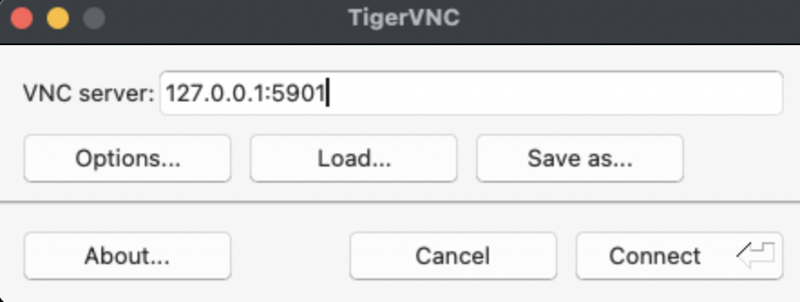

Le client TigerVNC est ensuite lancé avec l'adresse `127.0.0.1:5901`.

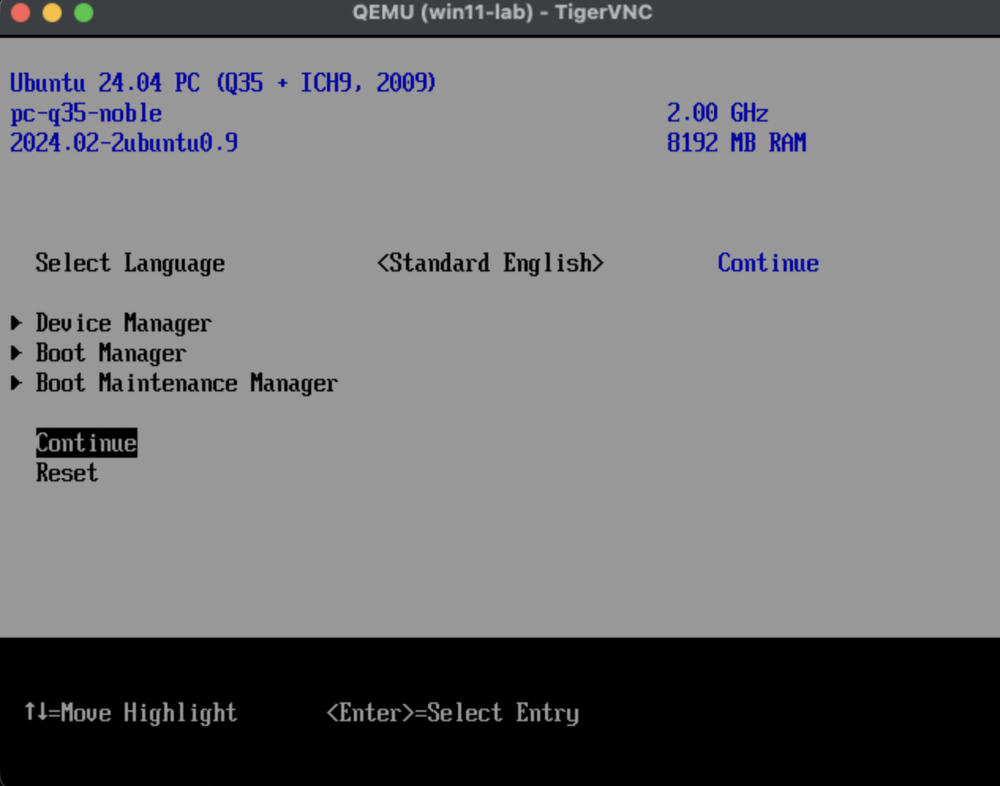

---

## 5.8 — Mise en place du tunnel SSH depuis le Mac M1

Le poste d'administration est un Mac M1.

Le tunnel SSH permet de transporter le port VNC de `x-srv01` vers le Mac sans exposer directement le serveur VNC sur le réseau.

Depuis le Mac, la commande suivante a été exécutée.

### Commande exécutée sur le Mac

```bash
ssh -L 5901:127.0.0.1:5901 kaman-goumou@192.168.1.17
```

### Résultat

```text
mac@kgoumou ~ % ssh -L 5901:127.0.0.1:5901 kaman-goumou@192.168.1.17
The authenticity of host '192.168.1.17 (192.168.1.17)' can't be established.
ED25519 key fingerprint is: SHA256:mqdjxFJp1f2AlJdblWvQxWtTgKUVgL9oh64cv42vhzo
This host key is known by the following other names/addresses:
    ~/.ssh/known_hosts:83: 192.168.20.14
    ~/.ssh/known_hosts:86: 192.168.20.18
    ~/.ssh/known_hosts:88: 192.168.20.20
    ~/.ssh/known_hosts:89: 192.168.20.8
    ~/.ssh/known_hosts:93: 192.168.120.1
Are you sure you want to continue connecting (yes/no/[fingerprint])? yes
Warning: Permanently added '192.168.1.17' (ED25519) to the list of known hosts.
kaman-goumou@192.168.1.17's password:
Welcome to Ubuntu 24.04.4 LTS (GNU/Linux 7.0.0-31-generic x86_64)

 * Documentation:  https://help.ubuntu.com
 * Management:     https://landscape.canonical.com
 * Support:        https://ubuntu.com/pro
Last login: Mon Sep  7 05:32:28 2026 from 100.81.200.93
kaman-goumou@x-srv01:~$
```

### Fonctionnement du tunnel

La partie `-L 5901:127.0.0.1:5901` signifie :

```text
Port 5901 du Mac
        │
        │ tunnel SSH
        ▼
Port 5901 de x-srv01
        │
        ▼
VNC de win11-lab
```

La session SSH doit rester ouverte pendant l'utilisation de la console VNC.

---

## 5.9 — Validation du tunnel avec netcat

Avant d'ouvrir la console graphique, la disponibilité du port local a été testée depuis le Mac.

### Commande exécutée sur le Mac

```bash
nc -vz 127.0.0.1 5901
```

### Résultat

```text
mac@kgoumou ~ % nc -vz 127.0.0.1 5901
Connection to 127.0.0.1 port 5901 [tcp/*] succeeded!
mac@kgoumou ~ %
```

### Interprétation

Le résultat `Connection to 127.0.0.1 port 5901 succeeded!` confirme que le port VNC est bien accessible depuis le Mac à travers le tunnel SSH.

La chaîne de connexion est donc validée :

```text
Mac M1
   │
   │ TCP 5901
   ▼
Tunnel SSH
   │
   ▼
x-srv01 : 127.0.0.1:5901
   │
   ▼
QEMU / VNC
   │
   ▼
win11-lab
```

---

## 5.10 — Connexion avec TigerVNC

Le client TigerVNC a ensuite été utilisé depuis le Mac.

Adresse saisie dans TigerVNC :

```text
127.0.0.1:5901
```

La connexion a réussi.

### Validation

TigerVNC a affiché :

```text
QEMU (win11-lab) - TigerVNC
```

Ce qui confirme que la connexion graphique cible bien la VM `win11-lab` et non une autre machine.

---

## 5.11 — Démarrage sur le firmware UEFI

Après connexion à la console VNC, la VM a affiché le menu UEFI OVMF.

L'écran indiquait notamment :

```text
Ubuntu 24.04 PC (Q35 + ICH9, 2009)
pc-q35-noble
2024.02-2ubuntu0.9
8192 MB RAM
```


### Interprétation

Cet écran correspond au firmware **OVMF/UEFI fourni par Ubuntu** sur l'hôte `x-srv01`.

La mention `Ubuntu 24.04 PC` concerne le firmware OVMF et **ne signifie pas que le système invité installé est Ubuntu**.

La présence de `Q35` et `8192 MB RAM` est également cohérente avec la configuration définie lors de la création de `win11-lab`.

---

## 5.12 — Sélection du périphérique de démarrage

L'option `Continue` du menu UEFI ne lançant pas directement Windows, le **Boot Manager** a été ouvert.

Le menu a affiché notamment :

```text
UEFI QEMU DVD-ROM QM000001
UEFI Misc Device
UEFI QEMU DVD-ROM QM000003
UEFI PXEv4 (MAC:52540041E112)
UEFI PXEv6 (MAC:52540041E112)
UEFI HTTPv4 (MAC:52540041E112)
UEFI HTTPv6 (MAC:52540041E112)
```

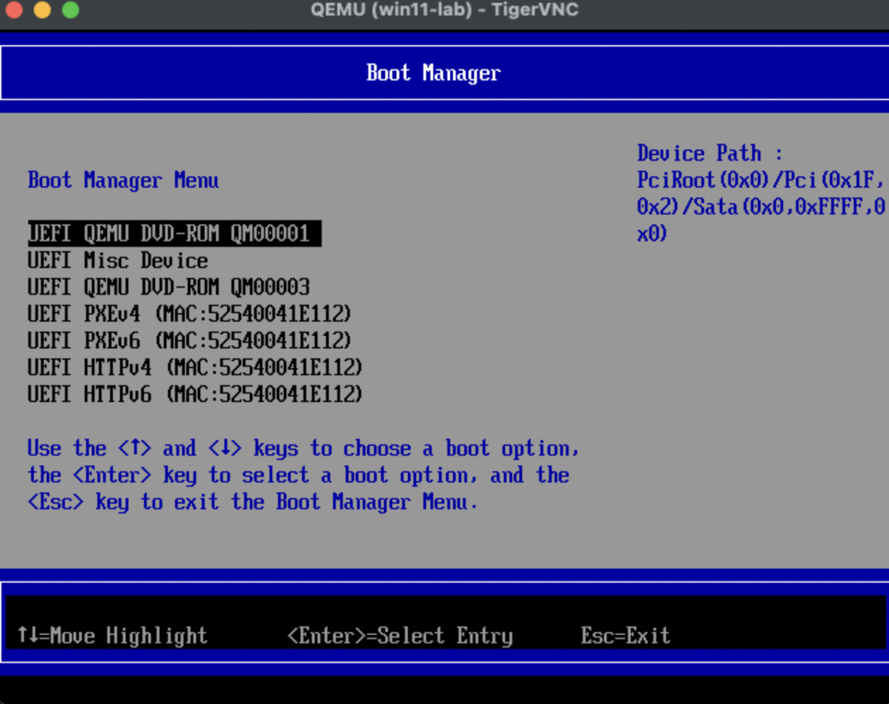

### Interprétation

La présence de deux entrées :

```text
UEFI QEMU DVD-ROM QM000001
UEFI QEMU DVD-ROM QM000003
```

confirme que les deux lecteurs CD-ROM virtuels sont présentés à la VM :

```text
Lecteur 1 → ISO Windows 11
Lecteur 2 → ISO VirtIO
```

L'entrée Windows a ensuite été sélectionnée manuellement :

```text
UEFI QEMU DVD-ROM QM000001
```

---

## 5.13 — Démarrage de Windows Setup

Après sélection du lecteur DVD contenant l'ISO Windows 11, l'installateur Windows a correctement démarré.

L'écran Windows Setup a été affiché avec :

```text
Language to install:
English (United Kingdom)

Time and currency format:
English (United Kingdom)

Keyboard or input method:
United Kingdom
```

### Validation

Cette étape confirme que :

```text
ISO Windows 11
        ↓
Lecteur CD-ROM virtuel
        ↓
Firmware UEFI OVMF
        ↓
Windows Setup
```

fonctionne correctement.

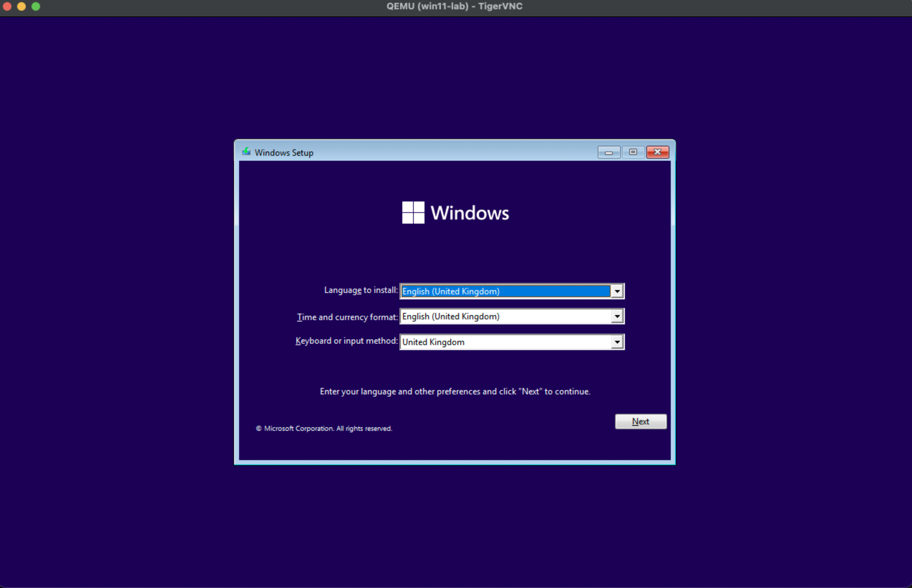

L'ISO Windows 11 est donc **correctement amorçable dans la VM `win11-lab`**.

---

## 5.14 — État de la VM à la fin de la Partie 5

À la fin de cette partie, les éléments suivants ont été validés :

| Élément | État |
|---------|------|
| VM `win11-lab` | ✅ Créée |
| VM démarrée | ✅ |
| 4 vCPU | ✅ Configurés |
| 8 GiB RAM | ✅ Configurés |
| Machine Q35 | ✅ |
| UEFI / OVMF | ✅ |
| TPM 2.0 | ✅ Configuré |
| Disque QCOW2 80 GiB | ✅ Attaché |
| Disque VirtIO | ✅ |
| Réseau VirtIO | ✅ |
| Réseau `default` | ✅ |
| ISO Windows 11 | ✅ |
| ISO VirtIO | ✅ |
| SPICE | ✅ Configuré |
| VNC | ✅ Configuré |
| VNC localhost | ✅ |
| Tunnel SSH Mac → x-srv01 | ✅ |
| Test TCP 5901 | ✅ |
| TigerVNC | ✅ Connecté |
| Boot UEFI | ✅ |
| Windows Setup | ✅ Démarré |

---

## 5.15 — Erreur rencontrée et correction

Une erreur a été rencontrée lors de la première tentative de création :

```text
An install method must be specified
```

### Cause

L'ISO Windows avait été déclarée comme simple périphérique CD-ROM avec `--disk path=...,device=cdrom` mais `virt-install` avait besoin d'une méthode d'installation explicite.

### Correction

La déclaration de l'ISO Windows a été remplacée par :

```bash
--cdrom /home/kaman-goumou/lab/kvm/iso/Win11_23H2_EnglishInternational_x64v2.iso
```

La deuxième ISO, destinée aux pilotes VirtIO, est restée déclarée comme CD-ROM :

```bash
--disk path=/home/kaman-goumou/lab/kvm/iso/virtio-win.iso,device=cdrom
```

La deuxième tentative a ensuite abouti à la création réussie de `win11-lab`.

---

## 5.16 — Architecture obtenue

À la fin de la Partie 5, l'architecture est la suivante :

```text
                         MAC M1
                           │
                           │ SSH
                           │
                 ┌─────────▼─────────┐
                 │      x-srv01      │
                 │ Ubuntu 24.04.4    │
                 │ KVM/QEMU/libvirt  │
                 └─────────┬─────────┘
                           │
                    tunnel SSH :5901
                           │
                           ▼
                    127.0.0.1:5901
                           │
                         VNC
                           │
                    ┌──────▼───────┐
                    │   win11-lab  │
                    ├──────────────┤
                    │ Q35          │
                    │ UEFI / OVMF  │
                    │ TPM 2.0      │
                    │ 4 vCPU       │
                    │ 8 GiB RAM    │
                    │ 80 GiB QCOW2 │
                    │ VirtIO       │
                    └──────┬───────┘
                           │
                  ┌────────┴────────┐
                  │                 │
             Windows ISO       VirtIO ISO
```

La VM est maintenant prête à poursuivre **l'installation proprement dite de Windows 11**, notamment la détection du disque VirtIO et le chargement éventuel des pilotes depuis `virtio-win.iso`.

---

# PARTIE 6 — INSTALLATION, CONFIGURATION INITIALE ET PRÉPARATION DE WINDOWS 11

---

## Partie 6 — Objectif

> **État : ✅ TERMINÉE**

Cette partie couvre la création et l'installation initiale de Windows 11 sur la VM `win11-lab`, le chargement des pilotes VirtIO nécessaires, le contournement de l'obligation de compte Microsoft pendant l'OOBE, la configuration réseau, les mises à jour Windows et l'arrivée sur un bureau Windows 11 fonctionnel.

La VM est maintenant opérationnelle et prête pour les opérations de préparation finale du template maître.

L'objectif de cette phase était de :

- démarrer Windows 11 dans la VM `win11-lab` ;
- installer Windows sur le disque QCOW2 de 80 GiB ;
- charger les pilotes VirtIO nécessaires ;
- rendre la carte réseau VirtIO fonctionnelle ;
- terminer l'assistant OOBE ;
- utiliser un compte local plutôt qu'un compte Microsoft ;
- connecter Windows à Internet ;
- effectuer les mises à jour du système ;
- arriver sur un Windows 11 propre et fonctionnel avant la phase d'optimisation et de préparation du template.

---

## 6.2 — Création de la VM Windows 11

La VM a été créée avec :

| Élément | Configuration |
|---------|---------------|
| **Nom** | `win11-lab` |
| **RAM** | 8 GiB |
| **vCPU** | 4 |
| **Machine** | Q35 |
| **Firmware** | UEFI / OVMF |
| **TPM** | TPM 2.0 |
| **Disque** | 80 GiB QCOW2 |
| **Bus disque** | VirtIO |
| **Réseau** | VirtIO |
| **Réseau libvirt** | `default` |
| **ISO Windows** | `Win11_23H2_EnglishInternational_x64v2.iso` |
| **ISO VirtIO** | `virtio-win-0.1.302` |
| **Console** | VNC + SPICE |

La première tentative de `virt-install` a échoué car aucune méthode d'installation n'avait été indiquée.

**Commande initiale :**

```bash
sudo virt-install \
  --name win11-lab \
  --memory 8192 \
  --vcpus 4 \
  --machine q35 \
  --boot uefi \
  --disk path=/var/lib/libvirt/images/win11-lab.qcow2,format=qcow2,bus=virtio \
  --disk path=/home/kaman-goumou/lab/kvm/iso/Win11_23H2_EnglishInternational_x64v2.iso,device=cdrom \
  --disk path=/home/kaman-goumou/lab/kvm/iso/virtio-win.iso,device=cdrom \
  --network network=default,model=virtio \
  --tpm emulator,version=2.0 \
  --graphics spice \
  --graphics vnc,listen=127.0.0.1 \
  --video virtio \
  --os-variant win11 \
  --noautoconsole
```

**Erreur :**

```text
ERROR
An install method must be specified
(--location URL, --cdrom CD/ISO, --pxe, --import, --boot hd|cdrom|...)
```

La commande a été corrigée en utilisant `--cdrom` pour l'ISO d'installation Windows.

**Commande corrigée :**

```bash
sudo virt-install \
  --name win11-lab \
  --memory 8192 \
  --vcpus 4 \
  --machine q35 \
  --boot uefi \
  --disk path=/var/lib/libvirt/images/win11-lab.qcow2,format=qcow2,bus=virtio \
  --cdrom /home/kaman-goumou/lab/kvm/iso/Win11_23H2_EnglishInternational_x64v2.iso \
  --disk path=/home/kaman-goumou/lab/kvm/iso/virtio-win.iso,device=cdrom \
  --network network=default,model=virtio \
  --tpm emulator,version=2.0 \
  --graphics spice \
  --graphics vnc,listen=127.0.0.1 \
  --video virtio \
  --os-variant win11 \
  --noautoconsole
```

**Résultat :**

```text
Starting install...
Creating domain...                                                                                      |    0 B  00:00:00

Domain is still running. Installation may be in progress.
You can reconnect to the console to complete the installation process.
```

### Résultat

La VM a été créée et démarrée avec succès.

---

## 6.3 — Accès à la console VNC

La console VNC de la VM a été identifiée avec :

```bash
sudo virsh vncdisplay win11-lab
```

**Résultat :**

```text
127.0.0.1:1
```

Le display `:1` correspond au port **5901**.

L'accès depuis le Mac a été réalisé à travers un tunnel SSH :

```bash
ssh -L 5901:127.0.0.1:5901 kaman-goumou@192.168.1.17
```

Le tunnel a été testé avec :

```bash
nc -vz 127.0.0.1 5901
```

**Résultat :**

```text
Connection to 127.0.0.1 port 5901 [tcp/*] succeeded!
```

TigerVNC a ensuite permis d'accéder à la console graphique de Windows.

---

## 6.4 — Démarrage UEFI de Windows

La VM a correctement démarré via l'environnement UEFI TianoCore/OVMF.

Le menu de démarrage affichait notamment :

```text
UEFI QEMU DVD-ROM QM000001
UEFI Misc Device
UEFI QEMU DVD-ROM QM000003
UEFI PXEv4 (MAC:52540041E112)
UEFI PXEv6 (MAC:52540041E112)
UEFI HTTPv4 (MAC:52540041E112)
UEFI HTTPv6 (MAC:52540041E112)
```

Le lecteur contenant l'ISO Windows a été sélectionné.

Windows Setup a alors démarré.

---

## 6.5 — Paramètres régionaux

L'assistant d'installation a été configuré avec :

```text
Language to install:
English (United Kingdom)

Time and currency format:
English (United Kingdom)

Keyboard or input method:
United Kingdom
```


Ces paramètres ont été conservés.

---

## 6.6 — Détection du disque VirtIO

Lors de la sélection du disque d'installation, Windows Setup n'affichait initialement aucun disque.

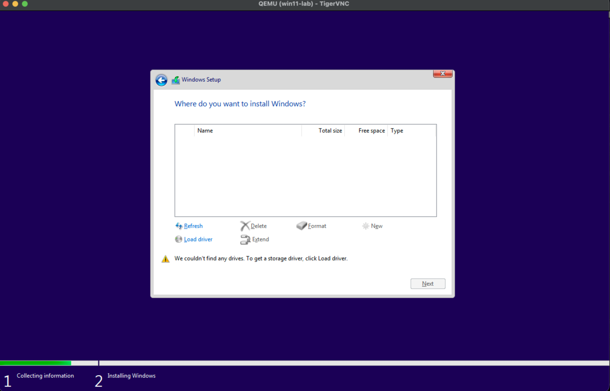

Le bouton **Load driver** a été utilisé.

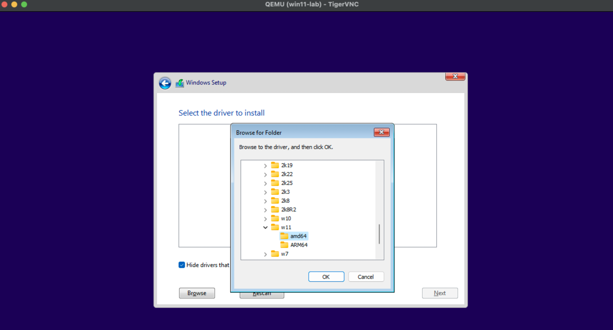

Le pilote de stockage VirtIO présent sur l'ISO `virtio-win-0.1.302` a été chargé.

Après chargement du pilote, Windows a correctement détecté le disque :

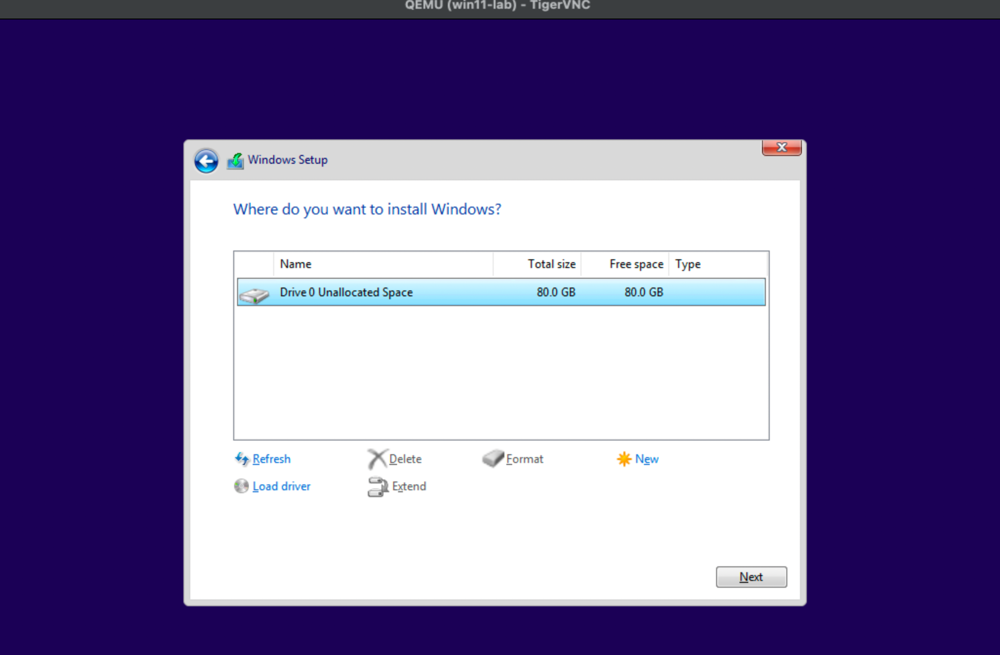

```text
Drive 0 Unallocated Space    80.0 GB    80.0 GB
```

Le disque a été sélectionné et l'installation de Windows a été lancée.

### Validation

Cette étape confirme que :

- le disque QCOW2 de 80 GiB est correctement présenté à QEMU ;
- le contrôleur VirtIO fonctionne ;
- l'ISO VirtIO est correctement attachée ;
- le pilote de stockage VirtIO est compatible avec Windows 11 ;
- Windows peut installer son système sur le disque VirtIO.

---

## 6.7 — Redémarrage pendant l'installation

Après l'installation des fichiers Windows, le système a redémarré.

La console VNC a temporairement été interrompue.

Une vérification de l'état de la VM a montré :

```text
shut off
```

La VM avait donc été arrêtée.

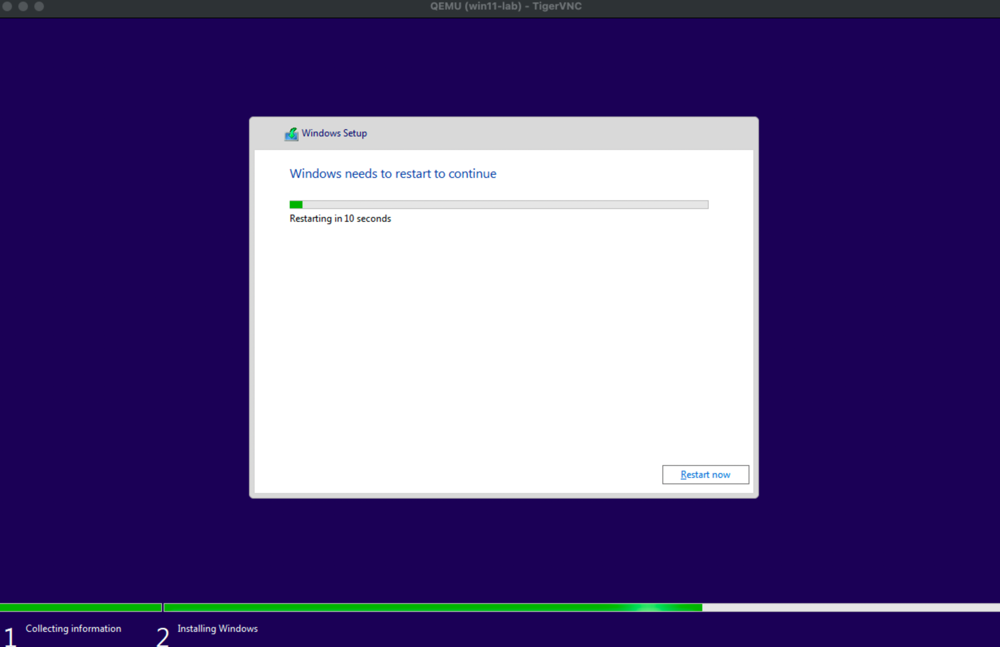

Le journal QEMU a indiqué :

```text
2026-09-07T07:37:32.710950Z qemu-system-x86_64: terminating on signal 15 from pid 7677 (/usr/sbin/libvirtd)
2026-09-07 07:37:32.930+0000: shutting down, reason=shutdown
```

La cause exacte de cet arrêt n'a pas été définitivement déterminée à partir des journaux disponibles.

La VM a cependant pu être redémarrée normalement.

---

## 6.8 — Redémarrage de `win11-lab`

**Commande exécutée :**

```bash
sudo virsh start win11-lab
```

**Résultat :**

```text
Domain 'win11-lab' started
```

**État vérifié :**

```bash
sudo virsh domstate win11-lab
```

**Résultat :**

```text
running
```

La VM a ensuite poursuivi sa configuration initiale.

---

## 6.9 — Première configuration Windows 11

Windows a affiché l'écran :

```text
Getting ready
```

puis l'écran de sélection de région :

```text
Is this the right country or region?

United Kingdom
```

Le choix a été validé avec **Yes**.


Windows a ensuite poursuivi l'assistant OOBE.

---

## 6.10 — Problème initial de réseau

Windows est arrivé sur :

```text
Let's connect you to a network
```

Aucune connexion réseau utilisable n'était initialement proposée.

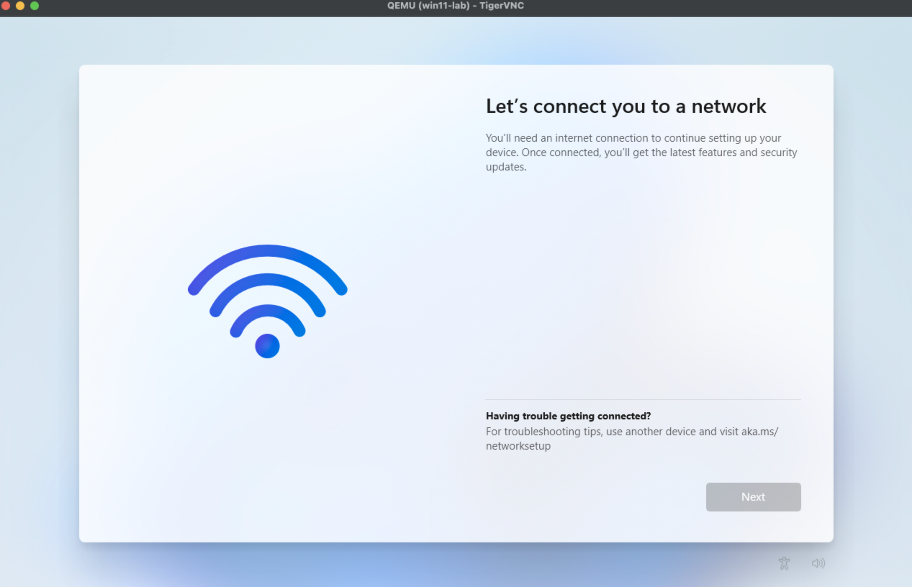

La VM utilise pourtant une carte réseau **VirtIO**.

Le problème venait du pilote réseau VirtIO qui n'était pas encore installé dans Windows.

---

## 6.11 — Identification du lecteur VirtIO

L'Invite de commandes Windows a été ouverte avec :

```text
Fn + Shift + F10
```

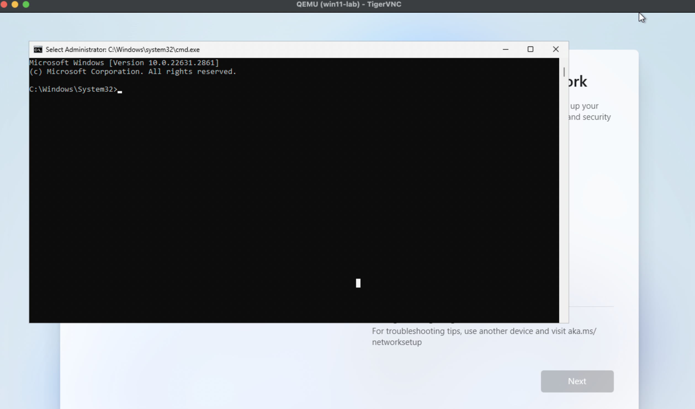

La commande suivante a été utilisée :

```cmd
wmic logicaldisk get deviceid,volumename
```

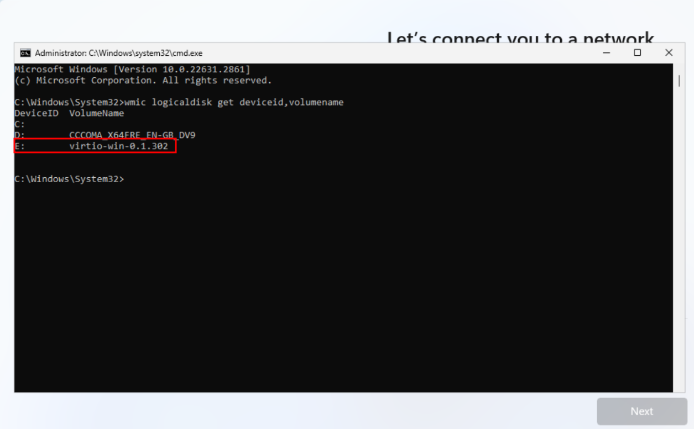

Le résultat a identifié les lecteurs :

```text
C:
D:    CCCOMA_X64FRE_EN-GB_DV9
E:    virtio-win-0.1.302
```

### Interprétation

Le lecteur `E:` correspondait bien à l'ISO VirtIO.

---

## 6.12 — Localisation du pilote réseau VirtIO

Le répertoire du pilote réseau Windows 11 64 bits a été identifié :

```text
E:\NetKVM\w11\amd64
```

Le contenu du répertoire a été vérifié avec `dir`.

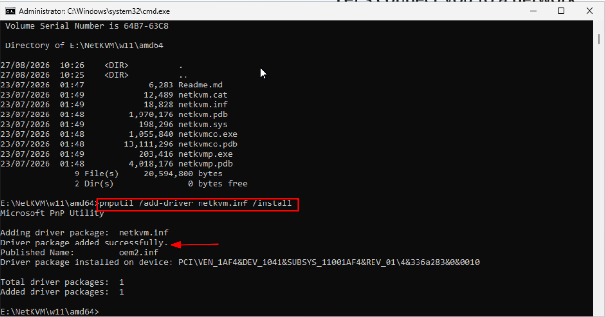

Les fichiers importants étaient notamment :

```text
Readme.md
netkvm.cat
netkvm.inf
netkvm.pdb
netkvm.sys
netkvmco.exe
netkvmco.pdb
netkvmp.exe
netkvmp.pdb
```

La présence de `netkvm.inf` et `netkvm.sys` confirmait que le pilote réseau VirtIO était disponible.


---

## 6.13 — Installation du pilote réseau VirtIO

Depuis `E:\NetKVM\w11\amd64>`, la commande suivante a été exécutée :

```cmd
pnputil /add-driver netkvm.inf /install
```

**Résultat :**

```text
Microsoft PnP Utility

Adding driver package:  netkvm.inf
Driver package added successfully.
Published Name:         oem2.inf
Driver package installed on device: PCI\VEN_1AF4&DEV_1041...
Total driver packages:  1
Added driver packages:  1
```

### Interprétation

Le pilote réseau VirtIO a été correctement installé.

La carte réseau virtuelle PCI identifiée par `PCI\VEN_1AF4&DEV_1041` a reçu son pilote.

### Validation

Après cette installation, **la connexion réseau Windows est apparue et est devenue fonctionnelle**.

Le réseau VirtIO est donc validé.

---

## 6.14 — Première tentative du bypass OOBE

Depuis `E:\NetKVM\w11\amd64>`, la commande :

```cmd
OOBE\BYPASSNRO
```

a été exécutée.

Windows a retourné :

```text
The system cannot find the path specified.
```

### Cause

La commande était exécutée depuis le lecteur `E:`.

Windows interprétait donc le chemin relatif comme appartenant au lecteur VirtIO, alors que `BYPASSNRO` se trouve dans l'environnement Windows.

---

## 6.15 — Correction du chemin pour `BYPASSNRO`

Le lecteur système Windows a été sélectionné :

```cmd
C:
```

Puis le répertoire OOBE a été rejoint :

```cmd
cd \Windows\System32\OOBE
```

La commande suivante a ensuite été exécutée :

```cmd
BYPASSNRO
```

Cette fois, la commande a été exécutée correctement.

Windows a affiché :

```text
Please keep your PC on.
```

puis a poursuivi le redémarrage et la configuration.

---

## 6.16 — Création d'un compte local

Après l'exécution de `BYPASSNRO`, la configuration OOBE a été poursuivie sans imposer la liaison à un compte Microsoft.

L'utilisateur a ensuite continué la configuration avec **la connexion Internet activée**, puis a terminé les étapes restantes de la première configuration Windows.

L'objectif du bypass était de conserver une installation maître indépendante de tout compte Microsoft personnel.

---

## 6.17 — Connexion Internet

Après le bypass, la connexion réseau a été conservée et Windows a poursuivi la configuration avec Internet.

Cette étape confirme que le pilote `NetKVM` installé précédemment permet bien à Windows 11 d'utiliser l'interface réseau VirtIO de la VM.

---

## 6.18 — Mises à jour Windows

Après la configuration initiale, les opérations restantes de Windows 11 ont été effectuées, notamment :

- configuration finale du système ;
- connexion Internet ;
- recherche et installation des mises à jour Windows ;
- redémarrages nécessaires ;
- finalisation de l'environnement Windows 11.

> Les commandes exactes utilisées pour ces opérations n'ont pas été conservées dans cette documentation et ne sont donc pas inventées ici.

---

## 6.19 — Arrêt volontaire de la VM pour reprise sur l'hôte

À un moment de la préparation, la VM a été arrêtée volontairement depuis l'hôte avec :

```bash
virsh destroy win11-lab
```

**Résultat :**

```text
Domain 'win11-lab' destroyed
```

### Explication

`virsh destroy` arrête immédiatement la VM, contrairement à un arrêt propre demandé au système invité.

Cette commande a été utilisée afin de reprendre le contrôle de la VM depuis l'hôte et poursuivre les opérations de préparation.

> **Important :** cette commande n'est pas une méthode normale d'arrêt du futur template. Pour la finalisation du template, un arrêt propre de Windows sera privilégié.

---

## 6.20 — Bureau Windows 11 fonctionnel

À la fin de cette phase, Windows 11 est arrivé sur son bureau.


La capture finale montre notamment :

- le bureau Windows 11 ;
- le menu Démarrer ;
- la barre des tâches ;
- Microsoft Edge ;
- la zone de notification ;
- l'interface réseau ;
- Windows correctement démarré.

La VM est donc fonctionnelle.

---

## 6.21 — État final de la Partie 6

| Élément | État |
|---------|------|
| VM `win11-lab` créée | ✅ |
| Q35 | ✅ |
| UEFI / OVMF | ✅ |
| TPM 2.0 | ✅ |
| 4 vCPU | ✅ |
| 8 GiB RAM | ✅ |
| QCOW2 80 GiB | ✅ |
| Contrôleur disque VirtIO | ✅ |
| Pilote stockage VirtIO | ✅ |
| Windows 11 installé | ✅ |
| Pilote réseau `NetKVM` | ✅ |
| Réseau VirtIO | ✅ |
| Internet Windows | ✅ |
| OOBE terminé | ✅ |
| Bypass compte Microsoft | ✅ |
| Configuration initiale | ✅ |
| Mises à jour Windows | ✅ |
| Bureau Windows 11 | ✅ |
| VM opérationnelle | ✅ |

---

## 6.22 — Validation de fin de phase

La phase d'installation et de première configuration de Windows 11 est considérée comme **terminée**.

L'image contient maintenant une installation Windows 11 fonctionnelle avec :

```text
Windows 11
    │
    ├── UEFI / OVMF
    ├── TPM 2.0
    ├── Disque VirtIO
    ├── Réseau VirtIO
    ├── Pilote NetKVM
    ├── Internet fonctionnel
    ├── Configuration OOBE terminée
    ├── Compte local
    └── Windows Update effectué
```

La VM `win11-lab` peut maintenant passer à la phase suivante du projet.

---

## 6.23 — Prochaine phase

La prochaine partie sera consacrée à la **préparation du Windows 11 maître** avant sa transformation en template QCOW2 réutilisable.

Elle pourra notamment couvrir :

1. vérification finale des pilotes ;
2. vérification de l'activation et de l'édition Windows ;
3. configuration des paramètres système utiles au laboratoire ;
4. installation des outils nécessaires ;
5. nettoyage des fichiers temporaires ;
6. nettoyage de Windows Update ;
7. optimisation de l'espace disque ;
8. éventuelle désactivation des éléments inutiles pour un template ;
9. préparation de Sysprep ;
10. généralisation de l'installation ;
11. arrêt propre de Windows ;
12. vérification du QCOW2 ;
13. compression éventuelle de l'image ;
14. validation finale du template maître.

> **Principe de documentation :** chaque commande réellement exécutée dans cette nouvelle phase sera ajoutée avec sa sortie exacte, son objectif, son fonctionnement et son interprétation. Aucune commande ou sortie ne sera inventée.

---

## 6.24 — Arrêt propre de Windows 11

Après avoir terminé l'installation, la configuration initiale, la connexion Internet et les mises à jour de Windows 11, la VM a été arrêtée proprement depuis Windows.

Vérification de l'état depuis l'hôte :

```bash
sudo virsh domstate win11-lab
```

**Résultat :**

```text
shut off
```

### Interprétation

La VM `win11-lab` est correctement arrêtée.

L'arrêt a été effectué depuis Windows et non avec `virsh destroy`, afin de conserver un état propre avant la préparation du template maître.

---

## 6.25 — Vérification des périphériques de stockage

**Commande :**

```bash
sudo virsh domblklist win11-lab
```

**Résultat :**

```text
Target   Source
---------------------------------------------------
vda      /var/lib/libvirt/images/win11-lab.qcow2
sda      /home/kaman-goumou/lab/kvm/iso/Win11_23H2_EnglishInternational_x64v2.iso
sdb      /home/kaman-goumou/lab/kvm/iso/virtio-win.iso
```

### Interprétation

Les trois périphériques étaient présents :

- `vda` → disque système Windows 11 ;
- `sda` → ISO d'installation Windows 11 ;
- `sdb` → ISO VirtIO.

Le disque `vda` devait être conservé.

Les deux médias ISO pouvaient maintenant être retirés.

---

## 6.26 — Éjection de l'ISO Windows 11

**Commande :**

```bash
sudo virsh change-media win11-lab sda --eject --config
```

**Résultat :**

```text
Successfully ejected media.
```

**Vérification :**

```bash
sudo virsh domblklist win11-lab
```

**Résultat :**

```text
Target   Source
---------------------------------------------------------
vda      /var/lib/libvirt/images/win11-lab.qcow2
sda      -
sdb      /home/kaman-goumou/lab/kvm/iso/virtio-win.iso
```

### Interprétation

L'ISO Windows a été correctement retirée de `sda`.

Le disque système `vda` n'a pas été modifié.

---

## 6.27 — Éjection de l'ISO VirtIO

**Commande :**

```bash
sudo virsh change-media win11-lab sdb --eject --config
```

**Résultat :**

```text
Successfully ejected media.
```

**Vérification :**

```bash
sudo virsh domblklist win11-lab
```

**Résultat :**

```text
Target   Source
---------------------------------------------------
vda      /var/lib/libvirt/images/win11-lab.qcow2
sda      -
sdb      -
```

### Interprétation

Les deux ISO sont maintenant déconnectées de la VM.

Les lecteurs virtuels `sda` et `sdb` restent présents dans la définition de la VM, mais aucun média n'y est attaché.

Le disque système reste :

```text
/var/lib/libvirt/images/win11-lab.qcow2
```

---

## 6.28 — Sauvegarde de la configuration libvirt

La configuration complète de la VM a été affichée avec :

```bash
sudo virsh dumpxml win11-lab
```

Cette commande permet de consulter la définition XML persistante utilisée par libvirt.

Les éléments importants confirmés sont :

### Identité

```text
Name: win11-lab
UUID: 8a471f94-bdf7-4767-8511-08821c096776
```

### Mémoire et CPU

```text
<memory unit='KiB'>8388608</memory>
<currentMemory unit='KiB'>8388608</currentMemory>
<vcpu placement='static'>4</vcpu>
```

Soit :

- RAM : **8 GiB**
- CPU : **4 vCPU**

### Firmware

```xml
<os firmware='efi'>
```

avec :

```xml
<loader readonly='yes' secure='yes' type='pflash'>/usr/share/OVMF/OVMF_CODE_4M.ms.fd</loader>
<nvram template='/usr/share/OVMF/OVMF_VARS_4M.ms.fd'>
```

La VM utilise donc :

- UEFI ;
- OVMF ;
- Secure Boot ;
- NVRAM persistante.

### Disque

```xml
<source file='/var/lib/libvirt/images/win11-lab.qcow2'/>
<target dev='vda' bus='virtio'/>
```

Le disque Windows utilise le bus **VirtIO**.

### Réseau

```xml
<mac address='52:54:00:41:e1:12'/>
<source network='default'/>
<model type='virtio'/>
```

La carte réseau utilise :

- réseau libvirt `default` ;
- modèle VirtIO ;
- adresse MAC `52:54:00:41:e1:12`.

### TPM

```xml
<tpm model='tpm-tis'>
  <backend type='emulator' version='2.0'/>
</tpm>
```

La VM dispose donc d'un **TPM 2.0 émulé**.

---

## 6.29 — Vérification de l'état administratif de la VM

**Commande :**

```bash
sudo virsh dominfo win11-lab
```

**Résultat :**

```text
Id:             -
Name:           win11-lab
UUID:           8a471f94-bdf7-4767-8511-08821c096776
OS Type:        hvm
State:          shut off
CPU(s):         4
Max memory:     8388608 KiB
Used memory:    8388608 KiB
Persistent:     yes
Autostart:      disable
Managed save:   no
Security model: apparmor
Security DOI:   0
```

### Interprétation

La VM est :

```text
State      : shut off
Persistent : yes
Autostart  : disable
```

Elle est donc arrêtée, persistante dans libvirt et **ne démarrera pas automatiquement avec l'hôte**.

---

## 6.30 — État final de cette étape

## WIN11-LAB — État après installation

| Élément                               | État        |
| ------------------------------------- | ----------- |
| **Windows 11 installé**               | ✅           |
| **Windows configuré**                 | ✅           |
| **Mises à jour effectuées**           | ✅           |
| **Réseau VirtIO**                     | ✅           |
| **ISO Windows déconnectée**           | ✅           |
| **ISO VirtIO déconnectée**            | ✅           |
| **Disque `win11-lab.qcow2` conservé** | ✅           |
| **UEFI / Secure Boot**                | ✅           |
| **TPM 2.0**                           | ✅           |
| **4 vCPU**                            | ✅           |
| **8 GiB RAM**                         | ✅           |
| **VM arrêtée**                        | ✅           |
| **Autostart**                         | ❌ Désactivé |

### État global

**✅ VM `win11-lab` correctement installée et préparée.**


## Conclusion

La VM `win11-lab` est maintenant dans un état propre pour poursuivre la préparation du **template maître Windows 11**.

Les deux ISO d'installation ont été retirées de la configuration persistante sans supprimer les fichiers ISO du serveur.

Le seul disque attaché contenant le système est :

```text
/var/lib/libvirt/images/win11-lab.qcow2
```

**Prochaine étape : préparation et optimisation du système Windows 11 avant la création du template maître.**

---

# ANNEXE A — RÉFÉRENCES TECHNIQUES

## ISO Windows 11

| Élément | Valeur |
|---------|--------|
| **Fichier ISO** | `Win11_23H2_EnglishInternational_x64v2.iso` |
| **Chemin complet** | `/home/kaman-goumou/lab/kvm/iso/Win11_23H2_EnglishInternational_x64v2.iso` |
| **Taille** | 6.4 Go |
| **Type** | ISO 9660 CD-ROM filesystem data (bootable) |
| **Label** | `CCCOMA_X64FRE_EN-GB_DV9` |
| **SHA-256** | `705ac061688ffd7f5721da844d01df85433856eafaa8441ece94b270685ca2db` |

## ISO VirtIO

| Élément | Valeur |
|---------|--------|
| **Fichier ISO** | `virtio-win.iso` |
| **Chemin complet** | `/home/kaman-goumou/lab/kvm/iso/virtio-win.iso` |
| **Version** | `0.1.302` |
| **Taille** | 837 Mo |
| **Type** | ISO 9660 CD-ROM filesystem data |
| **Label** | `virtio-win-0.1.302` |
| **SHA-256** | `303f7ae40dad495d6ae474fdc571df58958a4dbc5c37a522d80f9a203867949d` |

## Disque Windows 11

| Élément | Valeur |
|---------|--------|
| **Fichier** | `win11-lab.qcow2` |
| **Chemin** | `/var/lib/libvirt/images/win11-lab.qcow2` |
| **Format** | QCOW2 |
| **Capacité virtuelle** | 80 GiB |
| **Taille actuelle** | À vérifier |
| **Propriétaire** | libvirt-qemu |
| **Groupe** | kvm |
| **Permissions** | 660 |
| **Intégrité** | ✅ |

## VM Windows 11

| Élément | Valeur |
|---------|--------|
| **Nom** | win11-lab |
| **RAM** | 8 GiB |
| **vCPU** | 4 |
| **Machine** | Q35 |
| **Firmware** | UEFI / OVMF avec Secure Boot |
| **TPM** | 2.0 (emulator) |
| **Disque** | 80 GiB QCOW2 |
| **Bus disque** | VirtIO |
| **Réseau** | default (NAT) |
| **Carte réseau** | VirtIO |
| **MAC** | 52:54:00:41:e1:12 |
| **VNC** | 127.0.0.1:5901 |
| **État** | ✅ Arrêtée |

---

# ANNEXE B — ÉTAT DU PROJET GLOBAL

```text
PROJET WINDOWS 11 — KVM QCOW2 TEMPLATE

Partie 1 — Identification de l'environnement
████████████████████████████████████████ 100 %

Partie 2 — Préparation du projet et validation des médias
████████████████████████████████████████ 100 %

Partie 3 — Vérification des prérequis de la VM Windows 11
████████████████████████████████████████ 100 %

Partie 4 — Préparation de la VM Windows 11 maître
████████████████████████████████████████ 100 %

Partie 5 — Création et démarrage de la VM Windows 11
████████████████████████████████████████ 100 %

Partie 6 — Installation, configuration initiale et préparation de Windows 11
████████████████████████████████████████ 100 %

Partie 7 — Optimisation et préparation du template
                                         0 %

Partie 8 — Sysprep / généralisation
                                         0 %

Partie 9 — Création et optimisation du master QCOW2
                                         0 %

Partie 10 — Validation finale
                                         0 %
```

---

**Fin du guide — Windows 11 KVM Template QCOW2**

*Toutes les commandes, résultats, erreurs et corrections sont documentés tels que réellement exécutés.*

---

**Prochaine étape : Partie 7 — Optimisation et préparation du template**